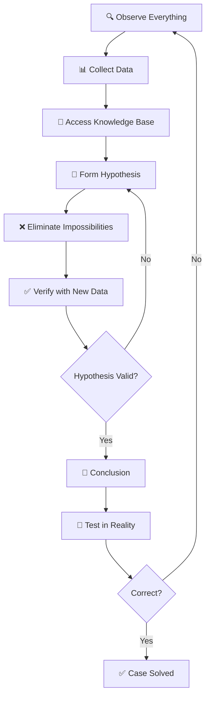

## 🎩 Pendahuluan: Siapa Sherlock Holmes?

**Sherlock Holmes** adalah detektif fiksi paling ikonik sepanjang masa, diciptakan oleh **Sir Arthur Conan Doyle** pada tahun **1887**. Pertama kali muncul dalam novel *A Study in Scarlet*, Holmes langsung memikat pembaca dengan **kecerdasan luar biasa**, **observasi tajam**, dan **metode deduksi yang sistematis**.

<Callout type="info" title="📚 Fun Facts">
- **56 cerita pendek** + **4 novel** ditulis oleh Conan Doyle
- **Alamat legendaris:** 221B Baker Street, London
- **Partner setia:** Dr. John Watson (dokter & penulis)
- **Musuh bebuyutan:** Professor Moriarty (jenius kriminal)
- **Hobi:** Bermain biola, eksperimen kimia, bela diri bartitsu
</Callout>

Holmes bukan sekadar detektif — ia adalah **simbol pemikiran rasional**, **logika murni**, dan **metode ilmiah** yang diterapkan pada pemecahan kasus. 🔍

---

## 🧠 The Science of Deduction: Inti Metode Holmes

Metode Holmes dibangun di atas fondasi yang ia sebut **"Science of Deduction"** — sebuah sistem berpikir yang menggabungkan **observasi tajam**, **pengetahuan luas**, dan **logika ketat**.

### 🔬 Prinsip Dasar

<Callout type="important" title="🎯 Kutipan Holmes yang Legendaris">
**"When you have eliminated the impossible, whatever remains, however improbable, must be the truth."**

*("Ketika Anda telah menyingkirkan yang mustahil, apa pun yang tersisa, betapa pun tidak mungkin, pastilah kebenaran.")*
</Callout>

**Proses berpikir Holmes:**

1. **Observasi** 👁️ — Mengumpulkan data mentah (visual, auditori, olfaktori)
2. **Deduksi** 🧩 — Menarik kesimpulan logis dari data
3. **Eliminasi** ❌ — Menyingkirkan kemungkinan yang tidak masuk akal
4. **Verifikasi** ✅ — Menguji hipotesis dengan bukti tambahan

### 🎭 Deduksi vs Induksi vs Abduksi

Holmes sebenarnya menggunakan kombinasi ketiga metode ini:

| Metode | Definisi | Contoh Holmes |
|--------|----------|---------------|
| **Deduksi** | Dari umum ke khusus (logika formal) | "Semua dokter punya stetoskop. Watson dokter. Jadi Watson punya stetoskop." |
| **Induksi** | Dari khusus ke umum (pola empiris) | "10 korban terakhir dicekik dengan tali sutra. Kemungkinan pembunuh punya akses ke tali sutra." |
| **Abduksi** | Inferensi ke penjelasan terbaik | "Sepatu berlumpur + hujan tadi malam + jalur tertentu = Ia datang dari area X" |

<Callout type="tip" title="💡 Insight">
**Yang membuat Holmes unik:** Ia menggabungkan **kecepatan deduksi formal** dengan **fleksibilitas abduksi kreatif**. Bukan sekadar logika, tapi **logika + imajinasi**. 🧠✨
</Callout>

---

## 👁️ Observasi: The Art of Seeing

Holmes berkata: **"You see, but you do not observe."** (Anda melihat, tapi tidak mengamati.)

Perbedaan krusial ini adalah **fondasi** dari seluruh metodenya.

### 🔍 Teknik Observasi Holmes

**1. Observasi Mikroskopis**

Holmes memperhatikan **detail terkecil** yang orang lain abaikan:

- 🥾 **Sepatu:** Lumpur di sepatu bisa mengungkap rute perjalanan (jenis tanah, cuaca, medan)
- 👔 **Pakaian:** Bekas jahitan, noda, debu → profesi, kebiasaan, aktivitas terakhir
- ✋ **Tangan:** Kapalan, noda tinta, kuku → pekerjaan manual vs intelektual
- 👀 **Mata:** Pupil, kantung mata, kilau → kesehatan, emosi, kebiasaan tidur
- 📜 **Tulisan:** Tekanan pena, spacing, tremor → karakter, kondisi mental, usia

**Contoh klasik** (dari *A Study in Scarlet*):

> Holmes menatap Watson dan langsung tahu: **"Anda datang dari Afghanistan."**

**Bagaimana?**
- Kulit terbakar matahari (tapi wajah lebih pucat — tanda topi militer)
- Lengan kaku (luka tembak)
- Sikap militer (postur)
- Waktu (tahun 1880-an, Inggris di perang Afghanistan)

✅ **Deduksi:** Dokter militer + luka tembak + timing = Afghanistan

**2. Observasi Multi-Sensori**

Holmes tidak cuma melihat — ia menggunakan **semua indera**:

- 👃 **Penciuman:** Mengenali 75 jenis tembakau dari baunya
- 👂 **Pendengaran:** Membedakan langkah kaki (berat, ritme, gaya berjalan)
- ✋ **Sentuhan:** Tekstur kertas, kualitas kain
- 👅 **Pengecapan:** Mendeteksi racun dari sisa di gelas (ekstrem, tidak disarankan! 😅)

**3. Observasi Konteks**

Holmes juga mengamati **konteks & anomali**:

- ❓ **Apa yang harusnya ada, tapi tidak?** (*The dog that didn't bark* — kasus Silver Blaze)
- ❓ **Apa yang tidak biasa?** (Misalnya: jam berhenti di waktu tertentu → petunjuk waktu kejadian)
- ❓ **Pola apa yang terganggu?** (Rutinitas korban)

<Callout type="quote" title="💬 Holmes tentang Observasi">
**"The world is full of obvious things which nobody by any chance ever observes."**

*("Dunia penuh dengan hal-hal jelas yang kebetulan tidak pernah diamati siapa pun.")*
</Callout>

---

## 📚 Knowledge Base: Ensiklopedia Hidup

Holmes bukan cuma mengamati — ia punya **basis pengetahuan yang luar biasa luas**, tapi **sangat selektif**.

### 🧠 The Holmesian Mind: What He Knows

Dalam *A Study in Scarlet*, Watson mencatat pengetahuan Holmes:

| Bidang | Level Pengetahuan Holmes |
|--------|--------------------------|
| **Literatur** | ⭐ Nihil (tidak peduli Shakespeare!) |
| **Filosofi** | ⭐ Nihil |
| **Astronomi** | ⭐ Nihil (tidak tahu bumi mengelilingi matahari!) |
| **Politik** | ⭐⭐ Samar-samar |
| **Botani** | ⭐⭐⭐ Ahli racun tanaman |
| **Geologi** | ⭐⭐⭐⭐ Praktis (mengenali lumpur London) |
| **Kimia** | ⭐⭐⭐⭐⭐ Mendalam (eksperimen forensik) |
| **Anatomi** | ⭐⭐⭐⭐⭐ Akurat (bedah mayat) |
| **Hukum Inggris** | ⭐⭐⭐⭐⭐ Sempurna |
| **Kriminal** | ⭐⭐⭐⭐⭐ Ensiklopedia kejahatan |

<Callout type="important" title="🎯 Filosofi Holmes tentang Pengetahuan">
**"I consider that a man's brain originally is like a little empty attic, and you have to stock it with such furniture as you choose."**

*("Saya menganggap otak manusia pada awalnya seperti loteng kosong kecil, dan Anda harus mengisinya dengan perabot yang Anda pilih.")*

**Prinsipnya:** Hanya simpan pengetahuan yang **relevan** dengan pekerjaan. Buang sisanya. 🧹

Mengapa? **Kapasitas otak terbatas.** Informasi tidak berguna hanya akan mengganggu. 🚫
</Callout>

### 📖 Bidang Spesialisasi Holmes

**1. Kimia Forensik**

Holmes adalah **pelopor forensik modern**. Ia punya laboratorium pribadi di Baker Street untuk:

- 🧪 Analisis darah (sebelum tes DNA!)
- 💉 Deteksi racun
- 🔬 Mikroskopi serat kain, rambut, debu
- 📄 Analisis tinta & kertas

**2. Kriminalitas & Kasus Historis**

Holmes punya **arsip mental** semua kasus kriminal terkenal:

- Modus operandi penjahat
- Pola kejahatan serial
- Jejak kriminal terkenal

Ia bisa langsung menghubungkan kasus baru dengan pola lama. 🗂️

**3. Antropologi Praktis**

Holmes bisa **membaca profesi & gaya hidup** dari penampilan:

- 👨‍💼 Pialang saham → Noda tinta di jari, koran finansial di saku
- ⚓ Pelaut → Tato, kulit terbakar angin, gaya berjalan
- 💪 Pekerja manual → Kapalan, otot tertentu
- 🎻 Musisi → Kapalan jari, postur

**4. Geografi & Topografi London**

Holmes menghafal **peta mental London** dengan detail luar biasa:

- Jenis lumpur per area
- Rute hansom cab (kereta kuda)
- Area berbahaya vs aman
- Tempat persembunyian kriminal

---

## 🧩 The Deduction Process: Step-by-Step

Mari kita breakdown proses deduksi Holmes secara detail. 🛠️

### 🎯 Case Study: *The Adventure of the Blue Carbuncle*

**Konteks:** Holmes menemukan topi tua. Dari topi itu, ia deduksi 7 fakta tentang pemiliknya **tanpa bertemu orangnya**.

**Observasi:**

1. 🎩 Topi sudah tua tapi berkualitas bagus
2. 💧 Debu di dalam (disimpan lama)
3. 🕯️ Lilin menempel (digunakan untuk penerangan)
4. 📏 Ukuran kepala besar (kapasitas otak besar?)
5. ✂️ Tidak dipotong rambut dalam minggu (tidak ada tukang cukur)
6. 💼 Label toko kelas menengah
7. 🍺 Noda di dalam (kemungkinan berkeringat/minum)

**Deduksi Holmes:**

<Callout type="success" title="✅ Kesimpulan Holmes">
**Pemilik topi adalah:**

1. 🧠 **Intelektual** (kepala besar = otak besar)
2. 💰 **Dulunya kaya** (topi bagus, tapi lama tidak dirawat)
3. 📉 **Sekarang miskin** (tidak mampu beli topi baru)
4. 👨‍💼 **Istri tidak peduli lagi** (tidak diingatkan potong rambut)
5. 🍺 **Kemungkinan alkoholik** (noda + degradasi hidup)
6. 🏚️ **Tidak punya gas di rumah** (pakai lilin untuk penerangan)
7. 🚶 **Jarang keluar** (debu banyak, topi jarang dipakai)

**Profil:** Pria setengah baya, intelektual yang jatuh miskin, kemungkinan karena alkohol, kehidupan rumah tangga hancur. 💔
</Callout>

**Hasilnya:** Watson cek pemilik topi → **100% akurat**! 🎯

### 🔄 The Holmes Method Loop



**Key points:**

- 🔄 **Iteratif:** Holmes tidak malu revisi hipotesis jika data baru muncul
- 🚫 **Anti-bias:** Ia secara aktif mencari bukti yang **membantah** teorinya
- ⚡ **Cepat:** Proses ini berjalan dalam hitungan detik di kepala Holmes

---

## 🏰 Mind Palace: Teknik Memori Holmes

Holmes punya **memori fotografis** yang luar biasa. Tekniknya? **Mind Palace** (Istana Memori).

### 🧠 Apa Itu Mind Palace?

**Mind Palace** adalah teknik mnemonic kuno (Method of Loci) di mana Anda:

1. 🏰 **Visualisasikan sebuah tempat** (istana, rumah, museum)
2. 🚪 **Tempatkan informasi di lokasi tertentu** (kamar, koridor, rak)
3. 🚶 **Berjalan mental** melalui istana untuk mengingat

**Contoh:** Ingin ingat 10 nama klien?

- 👨 Klien 1 → Di pintu depan
- 👩 Klien 2 → Di ruang tamu
- 👴 Klien 3 → Di dapur
- ... dst

**Ketika perlu ingat:** "Berjalan" mental melalui rumah → lihat wajah mereka di lokasi tersebut. 🚶‍♂️🏡

### 🎯 Holmes' Mind Palace

Holmes punya **arsitektur mental yang kompleks**:

- 📚 **Perpustakaan:** Kasus-kasus sebelumnya
- 🧪 **Laboratorium:** Pengetahuan kimia & forensik
- 🗺️ **Ruang peta:** Topografi London
- 🎭 **Galeri:** Wajah & profil kriminal
- 🔬 **Museum:** Artefak & bukti penting

<Callout type="tip" title="💡 Cara Membangun Mind Palace Anda">
**Langkah praktis:**

1. 🏠 **Pilih lokasi familiar** (rumah masa kecil, sekolah, kantor)
2. 🚪 **Definisikan rute jelas** (pintu depan → ruang tamu → kamar → dapur)
3. 📦 **Tempatkan info secara visual** (lebih aneh = lebih mudah diingat!)
4. 🚶 **Latih rutin** (jalan mental setiap hari)
5. 🔄 **Expand gradually** (tambah kamar untuk kategori baru)

**Pro tip:** Gunakan **emotional anchor** (emosi kuat = memori lebih kuat). 💪🧠
</Callout>

---

## 🎭 The Art of Disguise & Role-Playing

Holmes bukan hanya detektif — ia juga **master of disguise** (ahli penyamaran). 🥸

### 🎨 Teknik Penyamaran Holmes

**1. Transformasi Fisik**

Holmes bisa mengubah penampilannya secara drastis:

- 👴 **Pengemis tua** → Bungkuk, kumis palsu, pakaian compang-camping
- 🧑‍💼 **Pengusaha** → Setelan rapi, jenggot, aksen berbeda
- ⛪ **Pendeta** → Jubah, sikap kalem, cara bicara formal
- 🏇 **Groom (perawat kuda)** → Pakaian kerja, postur kasar

**Yang mengejutkan Watson:** Ia sering tidak mengenali Holmes sampai penyamaran dibuka! 😱

**2. Transformasi Mental**

Yang lebih penting dari kostum adalah **masuk ke karakter**:

- 🎭 **Adopsi mental model orang lain**
- 🗣️ **Ubah pola bicara, aksen, vocabulari**
- 🚶 **Ubah gaya berjalan, gestur, postur**
- 👁️ **Ubah tatapan mata & ekspresi**

<Callout type="quote" title="💬 Watson tentang Holmes">
**"He had so many facets to his character that I was continually surprised."**

*("Ia punya begitu banyak sisi kepribadian sehingga saya terus-menerus terkejut.")*
</Callout>

**3. Infiltrasi & Undercover**

Holmes sering menyamar untuk:

- 🕵️ **Mengumpulkan intel** tanpa kecurigaan
- 👂 **Mendengar gossip** di pub/pasar
- 🎣 **Memancing pengakuan** dari tersangka
- 🚪 **Akses tempat terlarang**

**Filosofi:** **"The best way to learn is to become."** (Cara terbaik belajar adalah menjadi.) 🦎

---

## ⚔️ Holmes vs Moriarty: Battle of Minds

**Professor James Moriarty** adalah **musuh terbesar** Holmes — jenius kriminal yang setara dalam intelektualitas. 🧠⚡🧠

### 🎓 Siapa Moriarty?

- 🧮 **Profesor matematika** (genius level)
- 🕸️ **Napoleon of Crime** (mastermind jaringan kriminal Eropa)
- 🎭 **Wajah publik:** Akademisi terhormat
- 🌑 **Wajah rahasia:** Otak dari 50% kejahatan London

<Callout type="danger" title="🚨 Holmes tentang Moriarty">
**"He is the Napoleon of crime, Watson. He is the organizer of half that is evil and of nearly all that is undetected in this great city."**

*("Ia adalah Napoleon kejahatan, Watson. Ia adalah pengorganisir setengah dari yang jahat dan hampir semua yang tidak terdeteksi di kota besar ini.")*
</Callout>

### ⚔️ Pertarungan Intelektual

**Karakteristik pertarungan Holmes vs Moriarty:**

| Aspek | Holmes 🕵️ | Moriarty 🦹 |
|-------|-----------|-------------|
| **Metode** | Deduksi + Observasi | Kalkulasi matematis + Prediksi |
| **Gaya** | Reaktif (menyelidiki kejahatan) | Proaktif (merancang kejahatan) |
| **Kekuatan** | Detail mikroskopis | Strategi makroskopis |
| **Kelemahan** | Kadang overconfident | Ego (ingin "menang" vs Holmes) |
| **Filosofi** | Keadilan & kebenaran | Kekuasaan & kontrol |

**Klimaks:** *The Final Problem* (1893) — Holmes dan Moriarty jatuh bersama di **Air Terjun Reichenbach** 💀

(Tapi Doyle akhirnya "menghidupkan" Holmes lagi karena tekanan fans! 😅)

### 🧠 What Makes Them Equal?

**Keduanya:**

- 🎯 Berpikir **10 langkah ke depan**
- 🕸️ Melihat **pola di dalam chaos**
- ⚡ **Instantaneous reasoning** (berpikir ultra cepat)
- 🎭 Master **manipulasi psikologis**

**Perbedaan krusial:** Holmes punya **empati** (peduli pada Watson, klien). Moriarty **tidak punya** (pure logic, no emotion). 💔

---

## 🛠️ Menerapkan Metode Holmes dalam Hidup Sehari-hari

Anda tidak perlu jadi detektif untuk menggunakan metode Holmes. Berikut cara praktisnya! 🎯

### 1️⃣ Latih Observasi

**Exercise:** **"The 5-Minute Observation Challenge"**

🕐 **Setiap hari:**

1. Pilih 1 orang di ruangan (atau foto)
2. Amati **5 menit** tanpa distraksi
3. Tutup mata, recall:
   - Warna pakaian
   - Aksesori (jam, cincin, tas)
   - Ekspresi wajah
   - Postur tubuh
4. Buka mata → cek akurasi

**Goal:** 80%+ akurasi dalam 2 minggu. 🎯

**Aplikasi praktis:**

- 💼 **Wawancara kerja:** Baca bahasa tubuh interviewer
- 🤝 **Negosiasi:** Deteksi ketidaknyamanan vs ketertarikan
- 👥 **Relasi:** Perhatikan perubahan mood partner/teman

### 2️⃣ Bangun Knowledge Base Selektif

**Prinsip Holmes:** **Kualitas > Kuantitas** 📚

**Action steps:**

1. 📝 **Identifikasi 3-5 domain krusial** untuk hidup/karir Anda
2. 🎯 **Go deep** (bukan sekadar surface knowledge)
3. 🚫 **Cut noise** (unfollow akun yang tidak relevan)
4. 🔄 **Update rutin** (baca jurnal, podcast, buku)

**Contoh domain untuk developer:**

- Bahasa pemrograman utama (TypeScript)
- System design & architecture
- AI/ML fundamentals
- User psychology

### 3️⃣ Praktikkan Deduksi

**Exercise:** **"Deduce Your Friend"**

Lihat foto teman/kolega:

- 🏠 **Latar belakang:** Apa yang bisa deduksi dari setting?
- 👗 **Pakaian:** Formal/kasual → situasi apa?
- 😊 **Ekspresi:** Genuine happiness atau forced smile?
- 🕐 **Waktu:** Pagi/sore (dari cahaya matahari)?

**Check dengan bertanya!** "Kamu lagi di X ya?" → verifikasi deduksi Anda. ✅

### 4️⃣ Gunakan Mind Palace

**Starter project:** **Hafal 10 hal penting**

Contoh: 10 nilai inti Anda

1. 🏠 Visualisasi rumah Anda
2. 🚪 Tempatkan 1 nilai di setiap ruangan
3. 🚶 Jalan mental setiap pagi
4. 🔁 Setelah 1 minggu, otomatis teringat!

**Level up:** Gunakan untuk **presentasi tanpa slide** (journey melalui istana = struktur presentasi). 🎤

### 5️⃣ Eliminasi Bias

Holmes selalu menguji **counter-evidence** (bukti yang membantah teorinya).

**Exercise:** **"Devil's Advocate Daily"**

- 💭 Ambil 1 belief Anda yang kuat
- ❓ Tanya: "Apa bukti yang bisa membantahnya?"
- 🔍 Cari **aktif** bukti counter
- ⚖️ Re-evaluate belief

**Goal:** Lebih objektif, kurang dogmatis. 🎯

### 6️⃣ Systematic Thinking

**Holmes tidak menebak — ia sistematis.**

**Framework:** **"The Holmes Checklist"** untuk problem-solving

```markdown
1. 🎯 **Define Problem** → Apa yang sebenarnya ingin diselesaikan?
2. 🔍 **Gather Data** → Observasi 360°, jangan skip detail kecil
3. 📚 **Access Knowledge** → Apa yang saya tahu tentang ini?
4. 🧩 **Form Hypotheses** → 3-5 kemungkinan penjelasan
5. ❌ **Eliminate Impossibilities** → Buang yang tidak masuk akal
6. ✅ **Test Remaining** → Eksperimen/validasi
7. 🎯 **Conclude** → Pilih penjelasan terbaik
8. 🔄 **Review** → Apa yang bisa dipelajari?
```

**Gunakan untuk:** Debugging code, memecahkan konflik, membuat keputusan besar. 💡

---

## 🎬 Holmes di Berbagai Media

Sherlock Holmes adalah **karakter fiksi yang paling banyak diadaptasi** sepanjang masa. 🎭

### 📺 Adaptasi Modern

**1. BBC Sherlock (2010-2017)** 🎩

- 🌆 **Setting:** London modern
- 🧠 **Sherlock:** Benedict Cumberbatch (jenius sosiopatik)
- 💊 **John Watson:** Martin Freeman (veteran Afghanistan, blogger)
- 📱 **Twist:** Teknologi modern (smartphone, internet, CCTV)
- ⭐ **Highlight:** Visualisasi deduksi Holmes di layar (genius!)

**2. Elementary (2012-2019)** 🔍

- 🗽 **Setting:** New York modern
- 🧔 **Sherlock:** Jonny Lee Miller (mantan addict, sober companion)
- 👩 **Joan Watson:** Lucy Liu (dokter → detektif)
- 💊 **Tema:** Recovery, addiction, gender dynamics

**3. Film Robert Downey Jr. (2009, 2011)** 💥

- 🥊 **Sherlock:** Action hero + detective (bartitsu, espionage)
- 🎩 **Lebih:** Visual spectacle, buddy comedy elements
- ⚔️ **Fokus:** Holmes vs Moriarty, Victorian steampunk aesthetic

### 🎮 Game

- 🕹️ **Sherlock Holmes: Crimes & Punishments** (choice-driven)
- 🧩 **The Testament of Sherlock Holmes** (puzzle-heavy)
- 🎲 **Sherlock Holmes: Consulting Detective** (board game)

### 📚 Spinoff & Reimaginasi

- 🔪 **Mr. Holmes** (film 2015) — Holmes tua, demensia, refleksi hidup
- 👨 **Enola Holmes** (film 2020) — Adik perempuan Holmes, YA fiction
- 🧛 **Sherlock Holmes vs Dracula** (crossover novel)

---

## 🧘 Kelemahan Holmes: Humanizing the Genius

Holmes bukan superhero sempurna. Ia punya **kelemahan fatal**. ⚠️

### 🚬 Addiction & Self-Destruction

**1. Cocaine & Morphine** 💉

Di cerita awal, Holmes **suntik kokain 7% solution** saat tidak ada kasus.

**Alasannya:**
> **"My mind rebels at stagnation. Give me problems, give me work... I abhor the dull routine of existence. I crave for mental exaltation."**

*("Pikiran saya memberontak pada stagnasi. Beri saya masalah, beri saya pekerjaan... Saya benci rutinitas hidup yang membosankan. Saya mendambakan eksaltasi mental.")*

**Interpretasi modern:** Holmes mungkin **ADHD** atau **highly gifted** — butuh stimulasi konstan. Tanpa kasus, ia **bosan sampai self-destruct**. 😔

**2. Tobacco** 🚬

Holmes **merokok pipa berjam-jam** saat berpikir. Watson sering temukan ia di ruangan berasap, tidak tidur semalaman.

### 💔 Emotional Detachment

**Holmes tidak punya kehidupan emosional normal:**

- 🚫 **Tidak tertarik romance** (kecuali Irene Adler — "The Woman")
- 🚫 **Sedikit teman** (hanya Watson)
- 🚫 **Tidak peduli etika sosial** (goal-oriented, ends justify means)

<Callout type="quote" title="💬 Holmes tentang Emosi">
**"The emotional qualities are antagonistic to clear reasoning."**

*("Kualitas emosional bertentangan dengan penalaran jernih.")*
</Callout>

**Trade-off:** Logika murni = kesepian emosional. 💔

### 🎭 Arrogance & Condescension

Holmes **tahu ia genius** — dan tidak segan menunjukkannya:

- 🙄 Meremehkan Scotland Yard (polisi resmi)
- 🎯 Sering "pamer" deduksi untuk shock value
- 😤 Tidak sabar dengan orang "bodoh"

**Watson sering harus "humanize" Holmes** untuk klien yang tersinggung. 😅

### 🌊 Depression

Ketika tidak ada kasus:

- 😴 Berbaring berjam-jam, tidak berbicara
- 🎻 Main biola melankolis
- 💊 Kembali ke substance abuse

**Modern diagnosis:** Kemungkinan **bipolar disorder** (high during cases, depressed during downtime). 🧠

---

## 🎯 Kesimpulan: Legacy of Sherlock Holmes

**Sherlock Holmes bukan sekadar karakter fiksi** — ia adalah **simbol dari apa yang bisa dicapai pikiran manusia** ketika dilatih dengan disiplin. 🧠✨

### 🏆 Why Holmes Matters

**1. Inspirasi untuk Forensik Modern** 🔬

Banyak teknik forensik **terinspirasi dari Holmes:**

- 🧪 Analisis darah
- 🔍 Analisis jejak
- 📜 Analisis dokumen
- 🚬 Identifikasi tembakau/racun

**2. Model Critical Thinking** 🎯

Metode Holmes adalah **template** untuk:

- 🕵️ Investigasi jurnalistik
- 🧑‍💼 Due diligence bisnis
- 🧑‍⚕️ Diagnosis medis
- 🧑‍💻 Debugging software

**3. Bukti Kekuatan Observasi** 👁️

Holmes membuktikan: **Jawaban ada di depan mata, jika Anda tahu cara melihat.** 🔍

**4. Balance Logika & Empati** ⚖️

**Watson melengkapi Holmes.** Tanpa Watson:

- Holmes terlalu dingin
- Holmes kehilangan humanity
- Holmes tidak punya anchor emosional

**Lesson:** **Genius butuh grounding.** Logika butuh empati. 🤝

### 💡 Final Wisdom

<Callout type="success" title="✅ The Holmesian Way of Life">
1. 👁️ **Observe everything** (dunia penuh petunjuk)
2. 🧠 **Curate your mind** (hanya simpan yang berguna)
3. 🧩 **Think systematically** (metode > intuisi)
4. ❌ **Eliminate bias** (uji counter-evidence)
5. 🔄 **Iterate & refine** (tidak malu salah, malu tidak belajar)
6. 🤝 **Stay human** (logika tanpa empati = cold machine)

**"It is a capital mistake to theorize before one has data."**

*("Adalah kesalahan besar untuk berteori sebelum seseorang memiliki data.")*

— Sherlock Holmes
</Callout>

---

## 🔗 Sumber Bacaan

**Original Canon:**
- 📚 *A Study in Scarlet* (1887) — Perkenalan pertama
- 📚 *The Sign of Four* (1890)
- 📚 *The Adventures of Sherlock Holmes* (1892) — 12 cerita terbaik
- 📚 *The Hound of the Baskervilles* (1902) — Novel terfavorit

**Modern Analysis:**
- 📖 *Mastermind: How to Think Like Sherlock Holmes* — Maria Konnikova
- 📖 *The Science of Sherlock Holmes* — E.J. Wagner

**Adaptasi:**
- 📺 BBC Sherlock (2010-2017) — Modern classic
- 🎬 Sherlock Holmes (2009) — Action-packed
- 📺 Elementary (2012-2019) — American twist

---

**Selamat berpikir seperti Holmes! 🕵️🔍**

*"The game is afoot!"*
