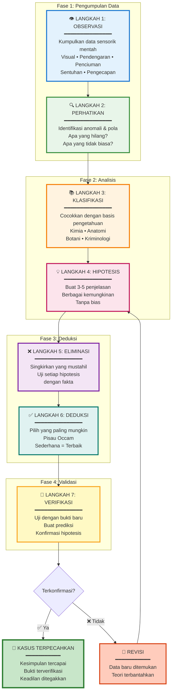
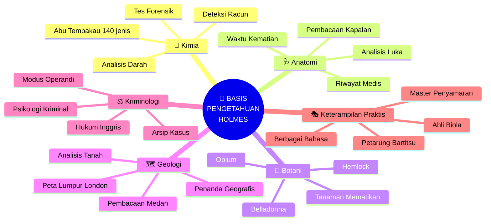
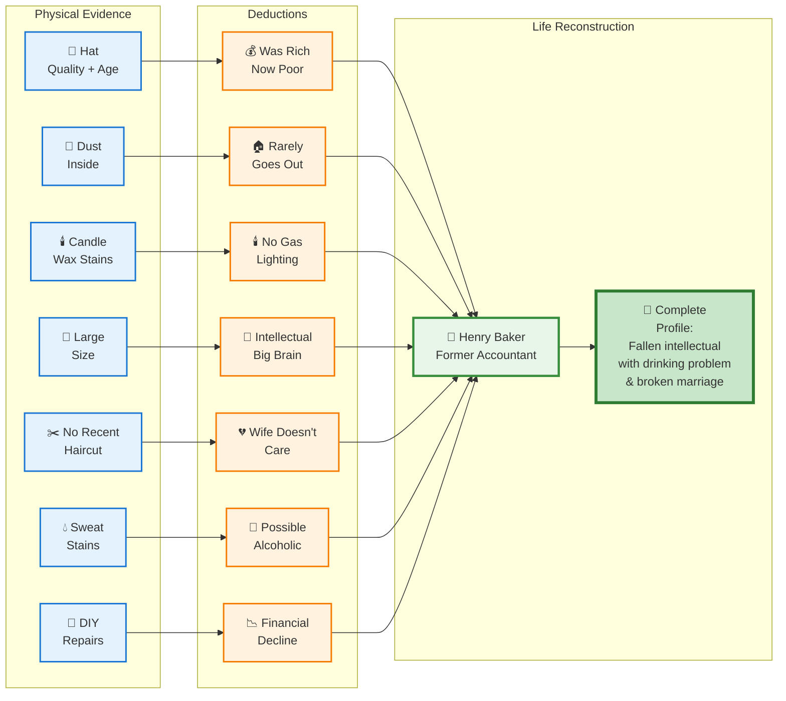

## 🔍 Pendahuluan: Anatomi Pikiran Holmes

Artikel ini adalah **deep dive teknis** ke dalam cara kerja pikiran Sherlock Holmes. Kita akan membedah **proses penalaran step-by-step**, menganalisis **kasus-kasus nyata** dari cerita asli Sir Arthur Conan Doyle, dan menguraikan **setiap ilmu** yang Holmes gunakan.

<Callout type="info" title="📚 Artikel Companion">
Ini adalah artikel lanjutan dari <WikiLink to="sherlock-holmes-metode-berpikir" label="Sherlock Holmes: Metode Berpikir Detektif" />.

Artikel sebelumnya membahas **overview** metode Holmes. Artikel ini fokus pada **teknis & praktik** dengan contoh kasus nyata. 🎯
</Callout>

**Yang akan kita pelajari:**

1. 🧠 **Proses penalaran deduktif** (step-by-step breakdown)
2. 🔬 **Ilmu-ilmu yang digunakan** (kimia, anatomi, botani, kriminologi, dll)
3. 📖 **5 kasus nyata** dengan analisis detail
4. 🧩 **Template penalaran** yang bisa Anda gunakan
5. 🎯 **Latihan praktis** untuk melatih deduksi

Mari kita mulai! 🚀

---

## 🧠 Proses Deduktif: Uraian Langkah demi Langkah

Holmes tidak "tiba-tiba tahu jawabannya" seperti kesan yang sering muncul. Ada **proses sistematis** yang berjalan di kepalanya.

### 🎯 Proses Penalaran Holmes dalam 7 Langkah



Mari kita breakdown **setiap tahap** dengan detail. 🧩

---

## 👁️ Langkah 1: OBSERVASI (Mengumpulkan Data Mentah)

**Tujuan:** Mengumpulkan **semua data sensorik** tanpa interpretasi.

**Prinsip Holmes:**
> **"Data! Data! Data! I can't make bricks without clay."**
> *("Data! Data! Data! Saya tidak bisa membuat bata tanpa tanah liat.")*

### 🔬 Observasi Multi-Indera

Holmes menggunakan **semua 5 indera** (dan kadang lebih):

**1. Visual (Penglihatan)** 👁️

- **Makro:** Tata letak ruangan, posisi tubuh, pencahayaan
- **Mikro:** Noda kecil, debu, goresan, warna tidak biasa
- **Temporal:** Perubahan dari waktu ke waktu (jam berhenti, tanaman layu)

**Contoh dari *A Study in Scarlet*:**
```
Holmes memperhatikan:
- Jejak kaki di karpet (2 set berbeda)
- Noda darah berbentuk percikan (bukan genangan)
- Tulisan di dinding: "RACHE" (dalam darah)
- Rokok dibiarkan menyala (abu panjang)
- Tidak ada jejak paksa masuk
```

**2. Auditory (Pendengaran)** 👂

- Langkah kaki (berat, ritme, gaya berjalan)
- Nada suara (gemetar, tegas, berbohong)
- Suara latar (lalu lintas, burung, pabrik → lokasi)

**3. Olfactory (Penciuman)** 👃

Holmes punya katalog mental **75 jenis tembakau** dari baunya!

- Bau tubuh (parfum, asap, alkohol, obat-obatan)
- Bau kimia (racun, pelarut, bahan bakar)
- Bau lingkungan (laut, hutan, pabrik)

**4. Tactile (Sentuhan)** ✋

- Tekstur (kertas, kain, kayu)
- Suhu (dingin → kematian baru, hangat → baru tiba)
- Kasar/halus (tangan pekerja vs tangan bangsawan)

**5. Gustatory (Pengecapan)** 👅

Holmes **pernah mencicipi zat mencurigakan** untuk identifikasi — **JANGAN DITIRU!** ⚠️ (sangat berbahaya!)

### 📊 Matriks Observasi

Holmes secara mental membuat **matriks observasi**:

| Kategori | Detail | Signifikansi |
|----------|--------|--------------|
| **Pakaian** | Jas mahal, tapi compang-camping | Dulunya kaya? |
| **Tangan** | Kapalan di jari telunjuk kanan | Penulis? |
| **Sepatu** | Lumpur merah di sol | Dari area X? |
| **Wajah** | Kulit terbakar + pucat di jidat | Topi sering dipakai? |

<Callout type="tip" title="💡 Latihan: Pemindaian 5 Menit">
**Praktik:**

1. Pilih 1 ruangan
2. Atur timer 5 menit
3. **Hanya observasi** (jangan interpretasi dulu!)
4. Catat semua yang Anda lihat dalam buku catatan

**Target:** 50+ item dalam 5 menit

**Tingkat lanjut:** Tutup mata, ingat kembali semua item. Periksa akurasi. 🎯
</Callout>

---

## 🔍 Langkah 2: PERHATIKAN (Identifikasi Anomali & Pola)

**Tujuan:** Memisahkan **signal** dari **noise**.

**Pertanyaan kunci Holmes:**

1. ❓ **Apa yang harusnya ada, tapi TIDAK ada?**
2. ❓ **Apa yang TIDAK seharusnya ada, tapi ADA?**
3. ❓ **Pola apa yang terganggu?**

### 🐕 Anjing yang Tidak Menggonggong

**Kasus:** *Silver Blaze* (kuda pacuan hilang, pelatih terbunuh)

**Dialog terkenal:**

**Inspektur Gregory:** "Apakah ada hal lain yang ingin Anda perhatikan?"

**Holmes:** "Pada kejadian aneh dengan anjing di malam hari."

**Inspektur:** "Anjing tidak melakukan apa-apa di malam itu."

**Holmes:** "Itulah kejadian yang aneh."

**Deduksi Holmes:**
```
1. Ada anjing penjaga di kandang
2. Anjing TIDAK menggonggong saat "penyusup" masuk
3. Anjing hanya diam jika mengenal orang tersebut
4. Jadi: Pelaku adalah orang yang dikenal anjing
5. Conclusion: ORANG DALAM (pelatih/groom)
```

✅ **Hasilnya:** Kasus terpecahkan. Pelaku adalah groom yang familiar dengan anjing. 🎯

<Callout type="important" title="🎯 Prinsip: Ketiadaan sebagai Bukti">
**Holmes mengajarkan:** **"Tidak adanya sesuatu adalah bukti."**

**Contoh modern:**

- Tidak ada jejak digital → orang ini paham teknologi (tahu cara hapus jejak)
- Tidak ada postingan media sosial → introvert / privat / akun dinonaktifkan
- Tidak ada foto keluarga di meja → pekerja keras / hubungan bermasalah

**Ketiadaan menceritakan sebuah kisah.** 🕵️
</Callout>

### 🧩 Pengenalan Pola

Holmes memiliki **basis data mental** pola kriminal:

**Contoh:**

**Pola pembunuhan:**
- Luka tembak jarak dekat → crime of passion atau eksekusi
- Luka tusuk multiple → emosional, tidak terencana
- Racun → terencana, pengetahuan medis/kimia

**Pola perampokan:**
- Barang berharga kecil hilang → profesional (tahu yang mudah dijual)
- Barang acak hilang → amatir (ambil apapun)
- Tidak ada yang hilang → bukan perampokan (ada motif lain)

---

## 📚 Langkah 3: KLASIFIKASI (Mencocokkan dengan Basis Pengetahuan)

**Tujuan:** Mengaktifkan **pengetahuan relevan** dari arsip mental.

Holmes memiliki **basis pengetahuan yang sangat spesifik**. Mari kita uraikan **setiap ilmu** yang ia kuasai.

### 🧬 Matriks Pengetahuan Holmes



### 🧪 1. Kimia Forensik

**Level Holmes:** ⭐⭐⭐⭐⭐ (Expert)

**Aplikasi:**

**A. Analisis Darah** 🩸

Di *A Study in Scarlet*, Holmes menciptakan **tes darah pertama** (fiksi, tapi memprediksi forensik modern!):

```
Holmes' Test for Blood:
1. Ambil sampel
2. Tambahkan reagent khusus
3. Jika darah → warna berubah biru
4. Bisa deteksi darah yang sudah diencerkan/dibersihkan
```

**Impact:** Ini **40 tahun sebelum tes Kastle-Meyer** yang nyata (1903)! 🤯

**B. Analisis Racun** ☠️

Holmes ahli dalam **toksikologi**:

| Racun | Deteksi | Kasus |
|-------|---------|-------|
| **Strychnine** | Konvulsi, rigor mortis cepat | *The Sign of Four* |
| **Curare** | Paralisis, tidak ada tanda luar | *The Sussex Vampire* |
| **Arsenic** | Gejala GI, bau bawang putih | *The Devil's Foot* |
| **Belladonna** | Pupil melebar, delirium | *The Creeping Man* |

**Teknik Holmes:**
- 🔬 Mikroskopi kristal (arsenic kristal vs garam)
- 🧪 Tes warna (reagent + racun → warna khas)
- 👃 Olfaktori (bau almond → sianida)

**C. Analisis Abu Rokok/Pipa** 🚬

Holmes menulis **monograf tentang 140 jenis abu tembakau**!

**Deduksi dari abu rokok:**
- 🌍 **Geografis:** Tembakau Virginia vs Turkish vs Indian
- 💰 **Ekonomi:** Cerutu mahal vs rokok murah
- ⏰ **Waktu:** Berapa lama sejak dihisap (warna abu)

### 🩺 2. Anatomi & Kedokteran

**Level Holmes:** ⭐⭐⭐⭐⭐ (Expert)

**Aplikasi:**

**A. Estimasi Waktu Kematian** ⏰💀

```
Indikator yang Holmes gunakan:

1. Suhu tubuh (turun ~1.5°F/jam)
2. Rigor mortis (mulai 2-6 jam, puncak 12 jam)
3. Livor mortis (darah mengendap, warna ungu)
4. Decomposition stage
5. Stomach contents (waktu makan terakhir)
```

**Contoh dari *The Boscombe Valley Mystery*:**

Holmes memeriksa mayat:
- Rigor mortis **penuh** → mati 12+ jam lalu
- Stomach **kosong** → belum makan pagi
- Matahari terbit jam 5:30 → mati sekitar jam 4-5 pagi
- ✅ **Kesimpulan:** Dibunuh pagi hari sebelum sarapan

**B. Analisis Luka** 🩹

Holmes bisa membedakan:

| Jenis Luka | Karakteristik | Kesimpulan |
|------------|---------------|------------|
| **Gunshot (jarak dekat)** | Luka bakar, powder burns | 0-2 feet, personal |
| **Gunshot (jarak jauh)** | Lubang bersih, no burns | Sniper / planned |
| **Stab wound (tajam)** | Tepian rapi, dalam | Pisau/dagger, profesional |
| **Blunt trauma** | Memar, tulang retak | Objek tumpul, emosional |

**C. Kapalan & Marks Profesi** ✋

Holmes bisa deduksi profesi dari tangan:

```
🖊️ Penulis: Kapalan jari tengah kanan, noda tinta
⚙️ Mekanik: Kulit kasar, noda oli, kuku hitam
🎻 Violinist: Kapalan di jari kiri, posisi spesifik
💼 Dokter: Tangan bersih, kuku pendek, bekas disinfektan
```

### 🌿 3. Botani (Khususnya Racun)

**Level Holmes:** ⭐⭐⭐ (Specialized)

**Fokus:** Tanaman beracun & obat-obatan herbal

**Tanaman yang Holmes kenal:**

**A. Deadly Nightshade (Belladonna)** 🌑

- **Efek:** Pupil melebar, halusinasi, kematian
- **Deteksi:** Pupil tetap melebar post-mortem
- **Kasus:** *The Speckled Band* (referensi)

**B. Hemlock** ☠️

- **Efek:** Paralisis bertahap (kaki → atas), pikiran tetap jernih
- **Famous victim:** Socrates
- **Deteksi:** Tidak ada konvulsi (vs strychnine)

**C. Opium Poppy** 🌺

- **Efek:** Euphoria, sedasi, addiction
- **Deteksi:** Pupil pin-point, smell manis
- **Context:** Holmes sendiri addict (kasus ironis 😔)

**D. Tobacco Variants** 🚬

Holmes menulis **"Upon the Distinction Between the Ashes of the Various Tobaccos"** — monograf 140+ jenis tembakau!

### 🗺️ 4. Geologi & Topografi

**Level Holmes:** ⭐⭐⭐⭐ (Practical Expert)

**Aplikasi:** Menentukan **lokasi dari lumpur/tanah**.

**The Mud Map of London** 🗺️

Holmes punya **mental map lumpur London**:

```
📍 Area → Karakteristik Lumpur

🏭 East End: Lumpur hitam (pabrik, coal ash)
🌊 Thames River: Lumpur coklat (clay + silt)
🌳 Hampstead Heath: Lumpur merah (iron oxide)
🐴 Regent's Park: Lumpur dengan jerami (stables)
🏗️ Construction sites: Lumpur putih (kapur, cement)
```

**Kasus Contoh:**

Suspect bilang dia di West End. Holmes lihat sepatu:
- ✅ Lumpur hitam (East End industrial)
- ✅ Partikel coal ash
- ❌ **BOHONG!** Dia sebenarnya di East End.

<Callout type="success" title="✅ Modern Equivalent">
**Forensik modern:** **Soil analysis** pakai spektroskopi untuk ID lokasi geografis spesifik!

Holmes memprediksi ini **100+ tahun lebih awal**. 🤯
</Callout>

### ⚖️ 5. Hukum & Kriminologi

**Level Holmes:** ⭐⭐⭐⭐⭐ (Expert)

**A. Criminal Psychology** 🧠

Holmes memahami **motivasi & pola pikir kriminal**:

| Tipe Kriminal | Karakteristik | Pendekatan Holmes |
|---------------|---------------|-------------------|
| **Profesional** | Terencana, cool-headed | Cari detail teknis (tools, timing) |
| **Passionate** | Impulsif, emosional | Cari relasi personal, love triangle |
| **Mental illness** | Pola aneh, irasional | Cari trigger, medical history |
| **Mastermind** | Brilliant, layered | Think 10 steps ahead (Moriarty) |

**B. Modus Operandi Database** 🗂️

Holmes punya **mental archive** semua kasus terkenal di Eropa:

```
📚 Categories in Holmes' Mind:

🔐 Burglary patterns
💀 Murder weapons & styles
💍 Jewelry heist techniques
🎭 Con artist schemes
🔥 Arson signatures
```

**Saat kasus baru:** Holmes langsung connect dengan **pola serupa** dari masa lalu.

**C. British Law** ⚖️

Holmes paham **legal technicalities**:

- Chain of custody (bukti harus terjaga)
- Admissible evidence
- Loopholes dalam hukum
- Statute of limitations

**Twist:** Holmes kadang **let criminals go** jika:
- Crime tidak berdampak besar
- Punishment tidak adil
- "Greater good" argument

**Contoh:** *The Adventure of the Blue Carbuncle* — Holmes biarkan pencuri pergi karena kasihan (Natal + first offense). 🎄

---

## 💡 Step 4: HYPOTHESIZE (Generate Kemungkinan Penjelasan)

**Tujuan:** Membuat **3-5 hipotesis alternatif** yang konsisten dengan data.

### 🧩 The Multiple Hypothesis Method

Holmes TIDAK langsung percaya 1 teori. Ia generate **beberapa kemungkinan**:

**Contoh:** Mayat ditemukan di ruangan terkunci.

**Hipotesis:**

1. **Suicide** (bunuh diri)
2. **Murder (inside job)** (pembunuhan oleh orang dalam)
3. **Murder (locked from outside)** (dikunci dari luar)
4. **Accident** (kecelakaan)
5. **Natural death + staging** (mati alami, tapi di-stage)

**Holmes kemudian test SEMUA** dengan data yang ada.

<Callout type="tip" title="💡 Avoid Confirmation Bias">
**Bias terbesar manusia:** Kita cenderung **cari bukti yang mendukung** teori favorit kita.

**Holmes melawan ini dengan:**

1. Generate hipotesis **sebelum** punya favorit
2. **Aktif cari** bukti yang **membantah** setiap hipotesis
3. **Revisi tanpa ego** kalau salah

**"It is a capital mistake to theorize before one has data."** 🎯
</Callout>

---

## ❌ Step 5: ELIMINATE (Singkirkan yang Mustahil)

**Tujuan:** Buang hipotesis yang **tidak konsisten** dengan fakta.

### 🎯 The Holmes Elimination Formula

<Callout type="quote" title="💬 Kutipan Paling Terkenal Holmes">
**"When you have eliminated the impossible, whatever remains, however improbable, must be the truth."**

*("Ketika Anda telah menyingkirkan yang mustahil, apa pun yang tersisa, betapa pun tidak mungkin, pastilah kebenaran.")*
</Callout>

**Process:**

```
Untuk setiap hipotesis:

1. List SEMUA implikasi yang harus benar
2. Check setiap implikasi dengan bukti
3. Jika ADA 1 saja yang contradicts → ELIMINATE
```

**Contoh:**

**Hipotesis:** Korban bunuh diri.

**Implikasi yang harus benar:**
- ✅ Senjata di tangan korban → **CHECK**
- ✅ Powder burns di tangan → **CHECK**
- ✅ Sudut tembakan masuk akal → **FAIL** (sudut impossible untuk self-inflict)

❌ **ELIMINATE:** Bukan bunuh diri.

---

## ✅ Step 6: DEDUCE (Pilih Penjelasan Paling Mungkin)

**Tujuan:** Dari hipotesis yang tersisa, pilih **yang paling sederhana & paling mungkin**.

### 🗡️ Occam's Razor

**Prinsip:** **"The simplest explanation is usually correct."**

**Holmes versi:**
> **"The simpler explanation, if it fits all facts, is preferable to the complex one."**

**Contoh:**

**Scenario:** Jendela pecah, perhiasan hilang.

**Hipotesis A:** Pencuri profesional, masuk lewat jendela, curi perhiasan.

**Hipotesis B:** Pencuri profesional, pecahkan jendela dari dalam untuk alibi, sebenarnya masuk lewat pintu dengan kunci duplikat, curi perhiasan.

**Data:** Kaca pecah ke LUAR (bukan ke dalam).

✅ **Deduksi:** Hipotesis B (lebih kompleks, tapi **sesuai data**). ✅

❌ **Bukan A** (karena contradicts fisika kaca).

**Lesson:** **Simplicity matters, BUT data > simplicity.** 🎯

---

## 🔬 Step 7: VERIFY (Uji dengan Bukti Baru)

**Tujuan:** **Test kesimpulan** dengan prediksi & bukti tambahan.

**Holmes tidak pernah "puas" sampai verify.**

### 🧪 The Verification Test

**Proses:**

1. **Make predictions** berdasarkan kesimpulan
2. **Gather new evidence**
3. **Check consistency**

**Contoh:**

**Kesimpulan:** Pembunuh adalah tukang pos.

**Prediksi yang harus benar:**
- Tukang pos punya **akses** ke alamat korban ✅
- Tukang pos punya **motif** (cek background) ✅
- Tukang pos punya **waktu** (cek route & timing) ✅
- Tukang pos punya **means** (cek apakah punya kunci master) ✅

**New evidence:** Holmes minta Scotland Yard cek log delivery → **CONFIRM!** Tukang pos ada di lokasi saat pembunuhan.

✅ **VERIFIED.** Kasus solved. 🎯

---

## 📖 KASUS 1: *A Scandal in Bohemia* — Deduksi Irene Adler

**Context:** Raja Bohemia minta Holmes ambil foto kompromi dari Irene Adler (penyanyi opera, mantan kekasih raja).

### 🔍 Observasi Holmes

**Target:** Irene Adler, wanita cerdas, cantik, berbahaya.

**Observasi awal:**

1. 🏠 **Rumah mewah** di St. John's Wood (area mahal)
2. 🚪 **Keamanan ketat** (butler, maid, locks)
3. 👗 **Fashion high-class**
4. 🎭 **Social calendar** (sering keluar, tapi tidak bawa foto)
5. 🔐 **Foto tersembunyi** (kemungkinan di rumah, tempat aman)

### 💡 Hipotesis

**Pertanyaan:** Di mana foto disimpan?

**Kemungkinan:**
1. Bank safe deposit
2. Lawyer's office
3. Hidden in house
4. Dengan teman terpercaya

### 🎭 The Plan: Fire Drill Test

Holmes menyamar sebagai **pendeta terluka**. Watson (accomplice) trigger **"fire" false alarm** di rumah Irene.

**Reasoning:**

> **"When a woman thinks her house is on fire, her instinct is to rush to the thing she values most."**

**Prediksi:** Irene akan **berlari ke lokasi foto** saat panik.

### ✅ Hasil

🔥 Watson teriak "FIRE!" → Irene **langsung lari ke panel dinding**, buka sliding panel → **FOTO KETEMU!** 📸

Holmes tahu lokasi. Mission accomplished... **atau belum?** 🤔

### 🎯 The Twist: Holmes Outsmarted

**Keesokan harinya:** Holmes kembali untuk ambil foto.

**Yang ditemukan:** 
- ❌ Foto **SUDAH HILANG**
- ✉️ Ada surat untuk Holmes

**Isi surat:**

> **"I have been trained as an actress. You did not realize that I recognized you, or that I followed you home."**

**Plot twist:** 🤯

- Irene **tahu Holmes menyamar**
- Irene **ikuti Holmes pulang** (tahu alamatnya)
- Irene **anticipate** rencana Holmes
- Irene **kabur dengan foto** (tapi janji tidak akan pakai untuk blackmail)

<Callout type="success" title="✅ Lesson: Holmes Meets His Match">
**Ini satu-satunya kali Holmes "kalah"** (tapi Irene tetap respect, tidak publish foto).

**Sejak saat itu:** Holmes selalu sebut Irene sebagai **"THE Woman"** — satu-satunya wanita yang pernah outsmart dia. 💕

**Lesson:** Bahkan genius bisa kalah dari **genius lain yang anticipate** langkah mereka. 🎭
</Callout>

---

## 📖 KASUS 2: *The Speckled Band* — Murder by Snake

**Context:** Helen Stoner datang ke Baker Street, ketakutan. Saudari kembarnya mati misterius 2 tahun lalu dengan kata terakhir: **"The speckled band!"**

### 👁️ Observasi Holmes

**Helen Stoner:**

- 👗 Pakaian hitam (berkabung)
- 😰 Ekspresi ketakutan ekstrem
- 💍 Tidak ada cincin kawin (single)
- 🤕 **Memar di pergelangan tangan** (kekerasan!)
- 🚂 Datang pagi-pagi (urgency tinggi)

**Cerita Helen:**

```
Timeline Kematian Julia (saudari kembar):

2 minggu sebelum: Julia akan menikah
1 minggu sebelum: Pindah kamar (renovasi)
Malam kejadian:
  - Julia tidur di kamar sebelah Helen
  - Pintu & jendela TERKUNCI dari dalam
  - Tengah malam: Helen dengar peluit rendah + suara logam
  - Julia teriak: "THE SPECKLED BAND!"
  - Julia mati dalam hitungan menit
  - Dokter: Tidak ada luka, tidak ada racun terdeteksi
```

**Current situation:**

Helen sekarang akan menikah. Pindah ke **kamar yang sama** tempat Julia mati. Dengar **peluit yang sama**. 😱

### 🧩 Hipotesis Holmes

**Pertanyaan:** Apa itu "speckled band"?

**Kemungkinan:**
1. Gypsy band (musisi gipsi — ada di estate)
2. Tali/belt berbintik
3. **Animal berbintik**

**Clues yang Holmes perhatikan:**

1. 🔐 **Locked room** → pelaku tidak masuk lewat pintu/jendela
2. 🎺 **Peluit** → animal training signal?
3. 🪢 **Suara logam** → chain?
4. ⚡ **Kematian cepat** → racun kuat atau suffocation
5. 🏠 **Stepfather = beneficiary** → motive! (uang warisan)
6. 🕳️ **Ventilasi aneh** menghubungkan kamar stepfather & Helen
7. 🛏️ **Bed dibaut ke lantai** → tidak bisa dipindah (kenapa?)

### 💡 Deduksi Holmes

**Reasoning chain:**

```
1. Locked room → pelaku NOT human (or entered via unusual route)
2. Ventilasi menghubungkan kamar → possible entry point
3. Bed tidak bisa dipindah → HARUS tidur di spot tertentu (why?)
4. Stepfather punya background India → akses ke exotic animals?
5. Peluit + logam → training & chain
6. "Speckled band" → NOT gypsy (Julia bilang "THE", bukan "A")
7. Racun tidak terdeteksi (1890s) → exotic venom
```

**Kesimpulan Holmes:**

🐍 **SNAKE!** (speckled = berbintik)

**Modus operandi:**

1. Stepfather latih ular berbisa
2. Kirim ular via **ventilasi shaft** tengah malam
3. Ular turun lewat **tali yang digantung** (suara logam = chain slide)
4. Ular gigit korban yang tidur di bed (yang dibaut tepat di bawah ventilasi)
5. Stepfather **panggil balik** dengan peluit
6. Ular naik kembali via tali
7. **No evidence!** (ular kembali ke kamar stepfather)

<Callout type="danger" title="🚨 The Trap">
Holmes & Watson **tunggu di kamar Helen** malam itu dengan **cane** (tongkat).

**Tengah malam:** 
- Peluit terdengar
- Holmes melihat **ular turun dari ventilasi**
- Holmes **PUKUL** ular dengan tongkat
- Ular **kembali ke ventilasi** (marah & terluka)
- **Stepfather berteriak** (ular gigit dia!)
- Stepfather **mati** dalam 10 detik (venom super kuat)

**Ular:** **Indian Swamp Adder** — salah satu ular paling mematikan. 🐍💀
</Callout>

### ✅ Kesimpulan

**Metode ilmiah Holmes:**

1. 🧪 **Zoologi** (pengetahuan exotic snakes)
2. 🏗️ **Arsitektur** (analisis ventilasi shaft)
3. 🧠 **Psychology** (motive: uang warisan)
4. ⚖️ **Physics** (bed placement + rope mechanics)

**Kasus solved. Helen selamat. Justice served.** 🎯

---

## 📖 KASUS 3: *The Red-Headed League* — The Perfect Distraction

**Context:** Jabez Wilson (tukang gadai, rambut merah cerah) datang dengan cerita aneh: dibayar £4/minggu untuk menyalin **ensiklopedia** 4 jam/hari. Tiba-tiba, liga bubar. 🤔

### 🔍 Observasi Holmes

**Jabez Wilson:**

- 🔴 **Rambut merah sangat cerah** (rare trait)
- 💼 **Tukang gadai** (punya toko)
- 📝 **Tulisan tangan kasar** (bukan scholar)
- 💰 **Butuh uang** (menerima pekerjaan aneh tanpa banyak tanya)
- 🤝 **Punya partner/assistant** (nama: Vincent Spaulding)

**Cerita Wilson:**

```
Timeline:

8 minggu lalu: 
  - Assistant (Vincent) lihat iklan: "RED-HEADED LEAGUE"
  - Job: Menyalin ensiklopedia, £4/week
  - Syarat: HARUS rambut merah cerah
  - Wilson apply → diterima

7 minggu kemudian:
  - Wilson kerja 4 jam/hari di kantor liga
  - Bayaran lancar
  
Tiba-tiba:
  - Kantor KOSONG
  - Surat: "Liga bubar"
  - ❓ WTF just happened?
```

### 💡 Holmes' Initial Thoughts

**Questions:**

1. ❓ Mengapa **rambut merah** syarat utama?
2. ❓ Mengapa **menyalin ensiklopedia** (pekerjaan tidak produktif)?
3. ❓ Siapa yang **sanggup bayar £4/week** untuk pekerjaan bodoh?
4. ❓ **Timing** — mengapa sekarang?

### 🚶 Holmes Visits the Scene

**Baker Street → Wilson's Pawnshop**

**Observasi:**

1. 🏦 **Lokasi:** Toko di **Saxe-Coburg Square** (area commercial)
2. 🏦 **Tetangga:** Di belakang toko ada **CITY AND SUBURBAN BANK** (bank besar!)
3. 🚪 **Layout:** Toko kecil, basement besar
4. 👨 **Assistant (Vincent):** Muda, energik, **lutut celana kotor** (❗red flag)

**Holmes mengetuk lantai toko dengan tongkatnya.**

**Sound:** **HOLLOW!** (basement cukup besar)

### 🧩 Deduksi Holmes

**Reasoning:**

```
1. "Red-Headed League" = SCAM (distraction)
2. Goal: Get Wilson OUT of shop 4 hours/day
3. Why? Vincent (assistant) butuh ACCESS ke basement
4. Why basement? Untuk DIG tunnel
5. Tunnel ke mana? Bank di belakang!
6. Lutut kotor = digging evidence
7. Timing: 8 minggu = cukup waktu untuk tunnel 30+ meter
8. Liga bubar tiba-tiba = tunnel SELESAI, siap untuk heist!
```

**Conclusion:** **Bank robbery in progress!** 🏦💣

### 🎯 The Trap

**Holmes + Watson + Police** tunggu di **bank vault** malam itu.

**Tengah malam:**

- 🕳️ **Lantai vault pecah**
- 👤 **2 orang keluar** dari tunnel (Vincent + partner)
- 🔫 **Police tangkap** keduanya

**Reveal:**

- "Vincent" = **John Clay** (master thief, paling dicari di England!)
- Partner = accomplice veteran
- Target: **£30,000 gold bullion** di vault

<Callout type="success" title="✅ Brilliant Deduction">
**Holmes solved case sebelum crime terjadi!** 🎯

**Metode yang digunakan:**

1. 🧠 **Pattern recognition** (scam distraction schemes)
2. 🗺️ **Spatial reasoning** (geography: shop → bank)
3. 🔍 **Physical evidence** (lutut kotor)
4. ⏰ **Timeline analysis** (8 minggu = feasible tunnel)
5. 🎭 **Criminal psychology** (modus operandi master thieves)

**Lesson:** **Cui bono?** (Who benefits?) Always ask: **"What's REALLY happening here?"** 🤔
</Callout>

---

## 📖 KASUS 4: *Silver Blaze* — The Dog That Didn't Bark

**Context:** Kuda pacuan terkenal (**Silver Blaze**) hilang. Pelatih (John Straker) ditemukan tewas di moor. Prime suspect: Fitzroy Simpson (penjudi).

### 🔍 Observasi Holmes

**Crime scene:**

1. 🐴 **Kuda hilang** (Silver Blaze, favorit untuk menang race besar)
2. 💀 **Pelatih mati** (kepala dipukul, luka di paha)
3. 🔪 **Pisau bedah** di tangan pelatih (why?)
4. 🐕 **Anjing penjaga** tidak menggonggong (❗KEY CLUE)
5. 🥘 **Kari malam itu** dibuat oleh maid (pelatih makan sebelum patroli)

**Suspect: Fitzroy Simpson**

- 🎲 Penjudi
- 💰 Big bet melawan Silver Blaze (motive: sabotase!)
- 🌙 Terlihat di area malam kejadian
- 💊 Punya **opium powder** (untuk drug kuda?)

**Evidence against Simpson:**

- ✅ Motive
- ✅ Opportunity
- ✅ Means (opium untuk drug kuda)

**Tapi Holmes TIDAK yakin.** ❓

### 💡 Holmes' Deduction

**Questions:**

1. 🐕 **Why anjing tidak bark?** (dog that didn't bark!)
2. 🔪 **Why pelatih bawa pisau bedah?** (bukan weapon biasa)
3. 🦵 **Why luka di paha kuda?** (bukan luka fatal)
4. 🥘 **Opium dalam kari** (stable boy tidur, tapi pelatih tidak — kenapa?)

**The Dog Question:**

> **"The curious incident of the dog in the night-time."**
> **"The dog did nothing."**
> **"That was the curious incident."**

**Reasoning:**

```
Anjing tidak bark → Anjing kenal "intruder"
Jadi: Pelaku = orang dalam (bukan Simpson!)
```

**The Knife Question:**

Pisau **bedah** (bukan pisau dapur/weapon) → untuk **surgery**?

**Surgery apa?** 🤔

**The Leg Wound:**

Holmes memeriksa kuda (yang akhirnya ditemukan):

- Luka di **tendon** paha kuda
- ❗ Attempt to **lame** the horse (bikin pincang untuk race!)

**Motive:** **Betting scam!**

### 🎯 The Solution

**Pelaku:** **John Straker** (sang pelatih sendiri!) 😱

**Modus operandi:**

1. 💰 Straker punya **utang besar** (kehidupan mewah + selingkuh)
2. 🎲 **Betting scheme:** Lame Silver Blaze → horse kalah → win bet melawan Silver Blaze
3. 🌙 **Malam itu:** Straker drug stable boy (opium di kari)
4. 🐴 Straker bawa Silver Blaze ke moor
5. 🔪 Straker coba **potong tendon** kuda dengan pisau bedah
6. 🦵 **Kuda tendang** Straker (self-defense!) → **Straker mati**
7. 🐴 Kuda **lari** (ditemukan kemudian di stable lain)

**Why anjing tidak bark?** Karena Straker = owner! Anjing kenal dia. ✅

**Simpson?** Innocent. Hanya kebetulan ada di area. ✅

### 🔍 Visual Timeline: The Silver Blaze Case

```mermaid
timeline
    title Timeline Kasus Silver Blaze
    section Persiapan
        2 minggu sebelum : Straker punya utang besar
                         : Rencanakan betting scam
        1 minggu sebelum : Beli pisau bedah
                         : Survey lokasi di moor
    section Malam Kejadian
        20:00 : Straker siapkan kari + opium
        20:30 : Stable boy makan kari (drugged)
        21:00 : Stable boy tertidur
        22:00 : Straker bawa Silver Blaze ke moor
              : Anjing tidak bark (kenal owner)
        22:30 : Straker coba potong tendon kuda
              : Kuda tendang (self-defense)
              : Straker mati seketika
        23:00 : Kuda lari ke stable tetangga
    section Investigasi
        Pagi : Mayat ditemukan
             : Kuda hilang
             : Simpson jadi suspect
        Siang : Holmes tiba di lokasi
              : Observasi crime scene
        Sore : Holmes temukan kuda
             : Periksa luka di paha
             : Deduksi: Inside job!
```

<Callout type="important" title="🎯 Holmes' Logic Chain">
**Step-by-step reasoning:**

1. Dog didn't bark → **Inside job**
2. Surgical knife → **Veterinary procedure** (not weapon)
3. Leg wound → **Attempt to lame horse**
4. Motive for laming → **Betting scam**
5. Who benefits? → **Trainer** (had debts)
6. Opium → Drug stable boy (create opportunity)
7. Kuda tendang → **Accidental death** (self-defense)

**Conclusion:** Trainer = mastermind. Killed by his own horse. **Poetic justice.** 🐴⚖️
</Callout>

### ✅ Lessons

**Metode Holmes:**

1. 🐕 **Absence as evidence** (dog didn't bark)
2. 🔍 **Forensic analysis** (knife type, wound location)
3. 💰 **Follow the money** (who benefits financially?)
4. 🧠 **Psychology** (financial pressure → crime)

**Quote:**

> **"See the value of imagination. We imagined what might have happened, acted upon the supposition, and find ourselves justified."**

---

## 📖 KASUS 5: *The Adventure of the Blue Carbuncle* — Deduksi dari Topi

**Context:** Holmes menemukan **topi tua** yang ditinggalkan di crime scene. Dari topi itu, ia deduksi **7 fakta** tentang pemiliknya.

### 👁️ Observasi Topi

**Physical evidence:**

1. 🎩 **Topi:** Kualitas bagus (dibeli di toko decent), tapi **sudah tua** (3 tahun)
2. 💨 **Debu:** Banyak debu **di dalam** topi
3. 🕯️ **Lilin:** Bekas lilin menempel (5+ spots)
4. 📏 **Size:** Besar (diameter 7 3/8 — kepala besar)
5. ✂️ **Rambut:** Tidak ada bekas potongan rambut baru (di dalam topi)
6. 💧 **Keringat:** Noda di headband dalam
7. 🏷️ **Label:** "H.B." tertulis di dalam
8. 🔨 **Repairs:** Bekas jahit di beberapa tempat (DIY repair, bukan profesional)

### 🧩 Deduksi Holmes (Step-by-Step)

**1. Kepala Besar = Intelektual?** 🧠

**Reasoning:**
- Size 7 3/8 = kepala di atas rata-rata
- Victorian belief: Cranial capacity ∝ Intelligence
- **Kesimpulan:** Pemilik kemungkinan **intelektual**

<Callout type="warning" title="⚠️ Catatan Modern">
**Ini PSEUDOSCIENCE!** Phrenology (ilmu tengkorak) **sudah dibantah**.

Holmes mengikuti belief zamannya (1890s). **Brain size ≠ intelligence.** 🧠

**Lesson:** Bahkan genius bisa salah jika mengikuti **bad science** zamannya. 🤔
</Callout>

**2. Dulunya Kaya** 💰

**Reasoning:**
- Topi **kualitas bagus** (harga mahal saat beli)
- Tapi **tidak dirawat** (debu, tidak dibersihkan)
- **Kesimpulan:** Dulunya punya uang untuk beli topi bagus, **sekarang tidak mampu** maintain.

**3. Sekarang Miskin** 📉

**Reasoning:**
- Tidak beli topi baru **3 tahun**
- DIY repair (bukan ke tukang jahit profesional)
- **Kesimpulan:** **Jatuh miskin**.

**4. Istri Tidak Peduli Lagi** 💔

**Reasoning:**
- Tidak ada potongan rambut baru (minimal **seminggu**)
- Istri yang peduli akan **remind** suami potong rambut
- **Kesimpulan:** **Kehidupan rumah tangga bermasalah**.

**5. Kemungkinan Alkoholik** 🍺

**Reasoning:**
- Noda keringat **banyak** di headband
- Bekas minuman (smell, discoloration)
- Degradasi hidup (miskin, istri tidak peduli)
- **Kesimpulan:** Kemungkinan **masalah alkohol** (penyebab jatuh miskin).

**6. Tidak Punya Gas di Rumah** 🕯️

**Reasoning:**
- Bekas lilin **5+ spots** (sering pakai lilin)
- Victorian era: Gas lighting = standard untuk kelas menengah
- Pakai lilin = **tidak mampu bayar gas**
- **Kesimpulan:** Rumah tidak punya gas lighting.

**7. Jarang Keluar** 🏠

**Reasoning:**
- Debu **banyak** di dalam topi
- Topi jarang dipakai
- **Kesimpulan:** Pemilik **jarang keluar rumah**.

### ✅ Verifikasi

Watson **cek pemilik topi** (nama dari label H.B. → Henry Baker).

**Hasil:**

✅ **100% AKURAT!** 🎯

- ✅ Intelektual (mantan accountant)
- ✅ Dulunya kaya (dulu successful)
- ✅ Sekarang miskin (business gagal)
- ✅ Istri bermasalah (konflik rumah tangga)
- ✅ Alkoholik (confirmed)
- ✅ Tidak punya gas (pakai lilin)
- ✅ Jarang keluar (depresi)

### 🎩 Deduction Flow: From Hat to Life Story



<Callout type="success" title="✅ Metode Observasi Holmes">
**Dari 1 objek sederhana (topi), Holmes rekonstruksi:**

1. 💰 Status ekonomi (dulu & sekarang)
2. 🧠 Profesi (intelektual)
3. 💔 Kehidupan rumah tangga (bermasalah)
4. 🍺 Kebiasaan buruk (alkohol)
5. 🏠 Kondisi rumah (tidak ada gas)
6. 🚶 Lifestyle (jarang keluar)

**7 fakta dari 8 observasi fisik.** Brilliant. 🎯
</Callout>

### 🔵 Bonus: The Blue Carbuncle Case

**Plot twist:** Topi bukan cuma topi — ada **permata langka** (Blue Carbuncle) tersembunyi di angsa yang dibeli pemilik topi!

**Mystery:** Bagaimana permata sampai di angsa? 🦢💎

**Holmes solved:** Chain of events tracking dari **pencurian permata** → **angsa di pasar** → **pemilik topi innocent** (kebetulan beli angsa yang salah).

**Ending:** Holmes **biarkan pencuri pergi** (first offense + Natal). Mercy > justice. 🎄

---

## 🧠 Template Penalaran Holmes (Praktis)

Sekarang mari kita buat **template** yang bisa Anda gunakan untuk problem-solving sehari-hari. 🛠️

### 📋 The Holmes Investigation Checklist

```markdown
## CASE ANALYSIS TEMPLATE

### 1. OBSERVATION PHASE 👁️
**Question:** What do I SEE/HEAR/SMELL/FEEL?

- [ ] Visual details (macro & micro)
- [ ] Auditory cues
- [ ] Olfactory cues
- [ ] Tactile information
- [ ] Temporal context (timing, sequence)

**Raw Data:**
- [List all observations without interpretation]

---

### 2. ANOMALY DETECTION 🔍
**Question:** What's ODD here?

- [ ] What SHOULD be here but ISN'T?
- [ ] What SHOULDN'T be here but IS?
- [ ] What pattern is BROKEN?

**Anomalies:**
- [List unusual findings]

---

### 3. KNOWLEDGE ACTIVATION 📚
**Question:** What do I KNOW that's relevant?

- [ ] Domain knowledge (tech, business, human behavior)
- [ ] Historical patterns (similar cases)
- [ ] Constraints (physical laws, rules, norms)

**Relevant Knowledge:**
- [List applicable frameworks/concepts]

---

### 4. HYPOTHESIS GENERATION 💡
**Question:** What COULD explain this?

**Hypothesis A:**
- Explanation: [...]
- Required conditions: [...]
- Probability: [Low/Medium/High]

**Hypothesis B:**
- Explanation: [...]
- Required conditions: [...]
- Probability: [Low/Medium/High]

**Hypothesis C:**
- Explanation: [...]
- Required conditions: [...]
- Probability: [Low/Medium/High]

---

### 5. ELIMINATION ❌
**Question:** Which hypotheses are IMPOSSIBLE?

**Test each hypothesis:**
- [ ] Does it fit ALL observed data?
- [ ] Does it violate any known constraints?
- [ ] Are all required conditions met?

**Eliminated:**
- [List ruled-out hypotheses + reasons]

---

### 6. DEDUCTION ✅
**Question:** What's the MOST LIKELY explanation?

**Selected Hypothesis:** [...]

**Reasoning:**
- Fits all data: [Yes/No + details]
- Simplest explanation: [Yes/No]
- No contradictions: [Yes/No]

---

### 7. VERIFICATION 🔬
**Question:** How can I TEST this?

**Predictions:**
- If hypothesis is true, then: [...]
- If hypothesis is false, then: [...]

**Test plan:**
- [ ] Gather additional evidence
- [ ] Run experiment/simulation
- [ ] Check with domain experts

**Result:**
- [Confirmed / Refuted / Inconclusive]

---

### 8. CONCLUSION 🎯
**Final Answer:** [...]

**Confidence Level:** [Low/Medium/High]

**Lessons Learned:**
- [What worked?]
- [What didn't?]
- [What would I do differently?]
```

<Callout type="tip" title="💡 Cara Pakai Template">
**Use cases:**

1. 🐛 **Debugging code** (why app crash?)
2. 💼 **Business analysis** (why sales turun?)
3. 🏥 **Medical diagnosis** (apa penyebab symptoms?)
4. 🔍 **Root cause analysis** (mengapa project gagal?)
5. 🧩 **Decision making** (pilihan mana yang terbaik?)

**Print & isi manual**, atau copy ke Notion/Obsidian untuk digital workflow. 📝
</Callout>

---

## 🎯 Latihan Praktis: Asah Deduksi Anda

Mari praktik! 💪

### 🏋️ Exercise 1: Photo Deduction

**Instruksi:**

1. Ambil **foto profil sosmed** teman/keluarga
2. Set timer **5 menit**
3. Tulis **10 deduksi** tentang:
   - 📍 Lokasi foto diambil
   - ⏰ Waktu (pagi/siang/sore/malam)
   - 🎭 Mood (genuine happy vs forced smile)
   - 👥 Context (sendiri/bersama/event)
   - 💼 Profesi (casual vs formal attire)

4. **Verifikasi:** Tanya orangnya!

**Goal:** 7/10 deduksi akurat. 🎯

---

### 🏋️ Exercise 2: Crime Scene Simulation

**Setup:**

1. Minta teman "crime" di ruangan (ambil 1 objek, pindah furniture, dll)
2. Anda masuk **5 menit setelah crime**
3. Observasi **3 menit**
4. Deduksi:
   - Apa yang diambil?
   - Siapa pelakunya?
   - Bagaimana cara masuk/keluar?

**Hints:**

- 👟 Jejak kaki di karpet
- 🚪 Pintu/jendela terbuka
- 📱 Benda hilang
- 🕐 Timing (fresh vs old disturbance)

**Goal:** Rekonstruksi 80%+ akurat. 🕵️

---

### 🏋️ Exercise 3: Stranger Deduction

**Instruksi:**

1. Pilih **stranger di cafe/public space**
2. Observasi **tanpa stalking** (ethical!)
3. Deduksi:
   - 💼 Profesi
   - 📚 Pendidikan level
   - 🏠 Tinggal sendiri/keluarga
   - 💰 Ekonomi status
   - 🎭 Personality traits

**Evidence:**

- 👗 Pakaian
- 💼 Tas/aksesori
- 📱 Gadget
- 📚 Baca apa
- ☕ Order apa
- 🤳 Behavior (nervous vs confident)

**Verification:** **JANGAN langsung tanya!** ❌ (creepy)

Instead: Reflect → "What clues led to conclusion?" → Learn pattern. 🧠

---

## 🎓 Kesimpulan: Menjadi Pemikir Holmesian

**Inti dari metode Holmes bukan** tentang menjadi detektif. Ini tentang **melatih pikiran** untuk:

### ✅ The 7 Holmesian Habits

1. 👁️ **Observe relentlessly** (dunia penuh data, jika Anda mau lihat)
2. 🧠 **Question everything** (never accept surface-level)
3. 📚 **Build specialized knowledge** (go deep dalam domain Anda)
4. 🧩 **Think in systems** (semuanya connected)
5. ❌ **Eliminate bias** (uji counter-evidence aktif)
6. 🔄 **Iterate without ego** (salah = learning opportunity)
7. 🔬 **Verify before concluding** (test, don't assume)

<Callout type="success" title="✅ Final Wisdom">
**Holmes bukan superhero.** Ia adalah **manusia yang melatih diri** dengan disiplin ekstrem.

**Good news:** **Anda bisa belajar ini!** 🎯

**Start small:**
- 5 menit observasi per hari
- 1 deduksi exercise per minggu
- Baca 1 cerita Holmes per bulan
- Gunakan template untuk 1 problem real

**Dalam 6 bulan:** Anda akan **berpikir lebih jernih**, **solve problem lebih cepat**, dan **melihat dunia dengan mata baru**. 🧠✨

**"The game is afoot!"** 🕵️🔍
</Callout>

---

## 📚 Resources untuk Belajar Lebih Lanjut

**Original Stories:**
- 📖 *The Adventures of Sherlock Holmes* (1892) — 12 cerita best
- 📖 *The Memoirs of Sherlock Holmes* (1893) — Termasuk *Silver Blaze*
- 📖 *The Return of Sherlock Holmes* (1905) — Holmes comeback!

**Modern Analysis:**
- 📘 *Mastermind: How to Think Like Sherlock Holmes* — Maria Konnikova (must-read!)
- 📘 *The Science of Deduction* — Ebook gratis (community-made)

**Practice:**
- 🎮 **Sherlock Holmes: Consulting Detective** (board game — exercise deduction)
- 🎮 **Crimes & Punishments** (video game — multiple solutions)

**Communities:**
- 💬 r/Sherlock_Holmes (Reddit)
- 💬 r/Deduction (practice deduction on photos)

---

**Selamat berpikir seperti Holmes!** 🎩🔍

*"You know my methods. Apply them."* — Sherlock Holmes
