## Peringatan dari Garis Depan 🚨

Bayangkan kembali bulan Februari 2020. Jika Anda cukup memperhatikan, mungkin Anda mendengar beberapa orang membicarakan tentang virus yang menyebar di luar negeri. Tapi kebanyakan dari kita tidak terlalu memperhatikan. Pasar saham sedang bagus, anak-anak masih sekolah, kita masih pergi ke restoran dan berjabat tangan, merencanakan perjalanan. 

Jika ada yang mengatakan mereka sedang menimbun tisu toilet, Anda akan berpikir mereka terlalu banyak menghabiskan waktu di sudut aneh internet. Lalu, dalam waktu sekitar tiga minggu, seluruh dunia berubah. Kantor tutup, anak-anak pulang, dan kehidupan berubah menjadi sesuatu yang tidak akan Anda percaya jika dijelaskan pada diri Anda sendiri sebulan sebelumnya.

<Callout type="danger" title="⚠️ Peringatan Serius dari Insider AI">
Matt Shumer, CEO HyperWriteAI yang telah menghabiskan enam tahun membangun startup AI dan berinvestasi di ruang ini, memberikan peringatan tegas:

**"Saya pikir kita sedang berada di fase 'ini sepertinya berlebihan' dari sesuatu yang jauh, jauh lebih besar daripada COVID."**

Ini bukan sensasionalisme. Ini adalah orang yang hidup di dunia AI setiap hari, memberitahu kita bahwa versi "sopan" yang selama ini dia ceritakan sudah tidak cukup lagi. Kesenjangan antara apa yang dia katakan dengan apa yang benar-benar terjadi telah menjadi terlalu besar.
</Callout>

## Mengapa Orang Tech Panik? Karena Ini Sudah Terjadi pada Mereka 💼

Inilah yang tidak dipahami oleh orang di luar dunia teknologi: **alasan banyak orang di industri ini membunyikan alarm sekarang adalah karena ini sudah terjadi pada kita**. Kita tidak membuat prediksi. Kita memberi tahu Anda apa yang sudah terjadi pada pekerjaan kita sendiri, dan memperingatkan bahwa giliran Anda berikutnya.

### Februari 2026: Titik Balik yang Tidak Bisa Dikembalikan 🔄

Pada **5 Februari 2026**, dua laboratorium AI besar merilis model baru pada hari yang sama:
- **GPT-5.3 Codex** dari OpenAI
- **Opus 4.6** dari Anthropic (pembuat Claude)

Dan sesuatu yang fundamental berubah.

<Callout type="example" title="💻 Pengalaman Nyata Seorang Software Engineer">
Matt Shumer menggambarkan pengalamannya sendiri:

**"Saya tidak lagi dibutuhkan untuk pekerjaan teknis aktual dari pekerjaan saya. Saya mendeskripsikan apa yang saya inginkan untuk dibangun, dalam bahasa Inggris biasa, dan itu hanya... muncul. Bukan draft kasar yang perlu saya perbaiki. Hal yang sudah jadi."**

Dia melanjutkan: "Saya memberi tahu AI apa yang saya inginkan, pergi dari komputer saya selama empat jam, dan kembali untuk menemukan pekerjaan selesai. Selesai dengan baik, selesai lebih baik daripada yang akan saya lakukan sendiri, tanpa koreksi yang diperlukan."
</Callout>

### AI yang Menguji Pekerjaannya Sendiri 🧪

Ini yang benar-benar mencengangkan:

AI sekarang tidak hanya menulis puluhan ribu baris kode. Ia **membuka aplikasi itu sendiri**. Ia **mengklik tombol-tombol**. Ia **menguji fitur-fitur**. Ia menggunakan aplikasi seperti yang dilakukan manusia. 

Jika ia tidak menyukai bagaimana sesuatu terlihat atau terasa, ia **kembali dan mengubahnya sendiri**. Ia beriterasi, seperti yang dilakukan developer, memperbaiki dan menyempurnakan hingga puas. Hanya setelah ia memutuskan aplikasi memenuhi standarnya sendiri, ia kembali dan berkata: **"Siap untuk Anda uji."**

Dan ketika diuji, biasanya sempurna. ✅

## Tapi Model Lama Kan Tidak Bagus? 🤔

Ini argumen yang paling sering muncul, dan Matt Shumer membahasnya dengan tegas:

<Callout type="warning" title="🕰️ Kesenjangan Persepsi yang Berbahaya">
**"Jika Anda mencoba ChatGPT di 2023 atau awal 2024 dan berpikir 'ini membuat hal-hal yang tidak masuk akal' atau 'ini tidak begitu mengesankan', Anda benar. Versi awal itu memang terbatas. Mereka berhalusinasi. Mereka dengan percaya diri mengatakan hal-hal yang omong kosong."**

**"Itu dua tahun yang lalu. Dalam waktu AI, itu adalah sejarah kuno."**

Model yang tersedia hari ini **tidak dapat dikenali** dari apa yang ada bahkan enam bulan lalu. Debat tentang apakah AI "benar-benar menjadi lebih baik" atau "mencapai dinding"—yang telah berlangsung selama lebih dari setahun—**sudah selesai**. Sudah berakhir.
</Callout>

### Masalah Versi Gratis 🆓

Sebagian besar masalahnya adalah **kebanyakan orang menggunakan versi gratis** alat AI. Versi gratis **lebih dari setahun di belakang** apa yang diakses pengguna berbayar.

> 💡 Menilai AI berdasarkan ChatGPT tingkat gratis seperti mengevaluasi keadaan smartphone dengan menggunakan ponsel flip. 📱

Orang-orang yang membayar untuk alat terbaik, dan benar-benar menggunakannya setiap hari untuk pekerjaan nyata, **tahu apa yang akan datang**.

### Kisah Nyata dari Dunia Hukum ⚖️

Matt menceritakan tentang seorang managing partner di firma hukum besar yang menghabiskan berjam-jam setiap hari menggunakan AI. Dia berkata itu seperti **memiliki tim associate yang tersedia secara instan**. 

Dia tidak menggunakannya karena itu mainan. Dia menggunakannya karena **itu bekerja**. Dan dia berkata sesuatu yang menancap:

<Callout type="quote">
**"Setiap beberapa bulan, ia menjadi jauh lebih mampu untuk pekerjaan saya. Jika ia tetap pada lintasan ini, saya berharap ia akan dapat melakukan sebagian besar dari apa yang saya lakukan sebelum lama... dan saya adalah managing partner dengan pengalaman puluhan tahun."**

Dia tidak panik. Tapi dia sangat memperhatikan. 👀
</Callout>

## Seberapa Cepat Ini Sebenarnya Berkembang? ⚡

Mari saya buat laju peningkatan ini konkret:

### Data dari METR: Panjang Tugas yang Dapat Diselesaikan 📊

Ada organisasi bernama **METR** yang mengukur ini dengan data. Mereka melacak panjang tugas dunia nyata (diukur dengan berapa lama waktu yang dibutuhkan ahli manusia) yang dapat diselesaikan model dengan sukses end-to-end tanpa bantuan manusia:

| Periode | Panjang Tugas |
|---------|---------------|
| Sekitar setahun lalu | ~10 menit |
| Beberapa bulan lalu | 1 jam |
| Beberapa waktu kemudian | Beberapa jam |
| November 2025 (Claude Opus 4.5) | Hampir 5 jam |
| Februari 2026 (Model terbaru) | Belum diukur, tapi lompatan sangat signifikan |

<Callout type="important" title="📈 Tren Eksponensial">
Angka itu **berlipat ganda sekitar setiap tujuh bulan**, dengan data terbaru menunjukkan mungkin mempercepat menjadi secepat **setiap empat bulan**.

Jika Anda memperpanjang tren (dan itu telah bertahan selama bertahun-tahun tanpa tanda-tanda mendatar):
- **AI yang dapat bekerja secara mandiri selama berhari-hari** dalam setahun ke depan
- **Berminggu-minggu** dalam dua tahun
- **Proyek-proyek bulanan** dalam tiga tahun

Dario Amodei (CEO Anthropic) telah mengatakan bahwa model AI **"secara substansial lebih pintar daripada hampir semua manusia pada hampir semua tugas"** berada di jalur untuk **2026 atau 2027**.
</Callout>

Biarkan itu meresap sebentar. Jika AI lebih pintar dari sebagian besar PhD, apakah Anda benar-benar berpikir ia tidak dapat melakukan sebagian besar pekerjaan kantor? 🎓

## AI Sekarang Membangun AI Berikutnya 🔄🤖

Ini adalah perkembangan paling penting dan paling tidak dipahami.

Pada 5 Februari, OpenAI merilis GPT-5.3 Codex. Dalam dokumentasi teknis, mereka menyertakan ini:

<Callout type="danger" title="🚨 Pengumuman Revolusioner dari OpenAI">
**"GPT-5.3-Codex adalah model pertama kami yang instrumental dalam menciptakan dirinya sendiri. Tim Codex menggunakan versi awal untuk men-debug pelatihan sendiri, mengelola deployment sendiri, dan mendiagnosis hasil tes dan evaluasi."**

**Baca itu lagi. AI membantu membangun dirinya sendiri.**

Ini bukan prediksi tentang apa yang mungkin terjadi suatu hari nanti. Ini adalah OpenAI memberi tahu Anda, sekarang, bahwa AI yang baru saja mereka rilis digunakan untuk menciptakan dirinya sendiri.
</Callout>

### Loop Umpan Balik yang Mempercepat 🔁

Dario Amodei, CEO Anthropic, mengatakan AI sekarang menulis **"sebagian besar kode"** di perusahaannya, dan bahwa loop umpan balik antara AI saat ini dan AI generasi berikutnya **"mengumpulkan momentum bulan demi bulan."**

Dia mengatakan kita mungkin **"hanya 1-2 tahun lagi"** dari titik di mana generasi AI saat ini secara otonom membangun yang berikutnya.

```mermaid
graph TD
    A[AI Gen 1: Capable] --> B[Helps Build Gen 2]
    B --> C[AI Gen 2: Smarter]
    C --> D[Builds Gen 3 Faster]
    D --> E[AI Gen 3: Even Smarter]
    E --> F[Builds Gen 4 Autonomously]
    F --> G[Intelligence Explosion 💥]
    
    style G fill:#ff6b6b,stroke:#c92a2a,stroke-width:3px
```

Setiap generasi membantu membangun yang berikutnya, yang lebih pintar, yang membangun yang berikutnya lebih cepat, yang lebih pintar lagi. 

Para peneliti menyebut ini **ledakan kecerdasan** (*intelligence explosion*). Dan orang-orang yang akan tahu—yang membangunnya—percaya prosesnya **sudah dimulai**. 💥

## Apa Artinya Ini untuk Pekerjaan Anda? 💼

Mari saya langsung karena saya pikir Anda layak mendapat kejujuran lebih dari kenyamanan.

<Callout type="danger" title="📉 Prediksi dari CEO Anthropic (Yang Paling Fokus Keamanan)">
Dario Amodei, yang mungkin CEO paling fokus-keamanan di industri AI, telah secara publik memprediksi bahwa AI akan **menghilangkan 50% pekerjaan white-collar tingkat pemula dalam satu hingga lima tahun**.

Dan banyak orang di industri berpikir dia **konservatif**. Mengingat apa yang dapat dilakukan model terbaru, kemampuan untuk gangguan masif bisa ada di sini pada **akhir tahun ini**. Butuh waktu untuk merambat melalui ekonomi, tapi kemampuan dasarnya tiba sekarang.
</Callout>

### Mengapa Ini Berbeda dari Semua Gelombang Otomasi Sebelumnya 🌊

Ini berbeda dari setiap gelombang otomasi sebelumnya, dan saya perlu Anda memahami mengapa:

**AI bukan menggantikan satu keterampilan spesifik. Ia adalah pengganti umum untuk pekerjaan kognitif. Ia menjadi lebih baik pada segalanya secara bersamaan.**

- Ketika pabrik diotomatisasi → pekerja yang terlantar bisa dilatih ulang sebagai pekerja kantor
- Ketika internet mengganggu ritel → pekerja pindah ke logistik atau layanan
- **Tapi AI tidak meninggalkan celah yang nyaman untuk pindah**

Apa pun yang Anda latih ulang, ia juga meningkat pada itu juga. 😰

### Contoh Pekerjaan yang Terpengaruh ⚠️

<Callout type="warning" title="🎯 Daftar ini TIDAK exhaustif!">
Jika pekerjaan Anda tidak disebutkan di sini, **itu TIDAK berarti aman**. Hampir semua pekerjaan pengetahuan sedang terpengaruh.
</Callout>

#### 1. Pekerjaan Hukum ⚖️

AI sudah dapat:
- Membaca kontrak
- Merangkum hukum kasus
- Menyusun briefing
- Melakukan penelitian hukum pada level yang menyaingi associate junior

Managing partner yang disebutkan tadi tidak menggunakan AI karena menyenangkan. Dia menggunakannya karena **ia mengungguli associate-nya pada banyak tugas**.

#### 2. Analisis Keuangan 💰

- Membangun model keuangan
- Menganalisis data
- Menulis memo investasi
- Menghasilkan laporan

AI menangani ini dengan kompeten dan meningkat cepat.

#### 3. Penulisan & Konten ✍️

- Salinan pemasaran
- Laporan
- Jurnalisme
- Penulisan teknis

Kualitasnya telah mencapai titik di mana **banyak profesional tidak dapat membedakan output AI dari pekerjaan manusia**.

#### 4. Software Engineering 💻

Ini bidang yang Matt Shumer tahu terbaik:

> **"Setahun lalu, AI hampir tidak bisa menulis beberapa baris kode tanpa kesalahan. Sekarang ia menulis ratusan ribu baris yang bekerja dengan benar. Bagian besar dari pekerjaan sudah diotomatisasi: bukan hanya tugas sederhana, tapi proyek kompleks multi-hari."**

**"Akan ada jauh lebih sedikit peran pemrograman dalam beberapa tahun daripada ada hari ini."**

#### 5. Analisis Medis 🏥

- Membaca scan
- Menganalisis hasil lab
- Menyarankan diagnosis
- Meninjau literatur

AI mendekati atau melebihi kinerja manusia di beberapa area.

#### 6. Customer Service 📞

Agen AI yang benar-benar mampu—bukan chatbot yang membuat frustrasi lima tahun lalu—sedang di-deploy sekarang, menangani masalah multi-langkah yang kompleks.

### Mitos "Hal-Hal Tertentu Aman" 🛡️

Banyak orang menemukan kenyamanan dalam gagasan bahwa hal-hal tertentu aman. Bahwa AI dapat menangani pekerjaan kasar tapi tidak dapat menggantikan penilaian manusia, kreativitas, pemikiran strategis, empati.

<Callout type="important" title="💭 Perubahan Perspektif Matt Shumer">
**"Saya dulu mengatakan ini juga. Saya tidak yakin saya masih mempercayainya."**

Model AI terbaru membuat keputusan yang terasa seperti penilaian. Mereka menunjukkan sesuatu yang terlihat seperti selera: rasa intuitif tentang apa panggilan yang tepat, tidak hanya yang benar secara teknis.

Setahun lalu itu akan tidak terpikirkan. **Aturan praktisnya sekarang: jika model menunjukkan bahkan petunjuk kemampuan hari ini, generasi berikutnya akan benar-benar baik padanya.** Hal-hal ini meningkat secara eksponensial, bukan linear.
</Callout>

Akankah AI mereplikasi empati manusia yang mendalam? Menggantikan kepercayaan yang dibangun selama bertahun-tahun hubungan? Tidak tahu. Mungkin tidak.

Tapi Matt sudah melihat orang-orang mulai mengandalkan AI untuk dukungan emosional, untuk nasihat, untuk persahabatan. Tren itu hanya akan tumbuh. 📈

### Kesimpulan Jujur tentang Keamanan Pekerjaan 🎯

<Callout type="danger" title="⚠️ Realitas yang Keras">
**"Saya pikir jawaban jujurnya adalah bahwa tidak ada yang dapat dilakukan di komputer aman dalam jangka menengah."**

Jika pekerjaan Anda terjadi di layar (jika inti dari apa yang Anda lakukan adalah membaca, menulis, menganalisis, memutuskan, berkomunikasi melalui keyboard) maka AI datang untuk bagian signifikan darinya.

**Timelinenya bukan "suatu hari nanti." Ini sudah dimulai.** 🕐
</Callout>

Akhirnya, robot akan menangani pekerjaan fisik juga. Mereka belum cukup di sana. Tapi "belum cukup di sana" dalam istilah AI memiliki cara menjadi "di sini" lebih cepat dari yang diharapkan siapa pun. 🤖

## Apa yang Seharusnya Anda Lakukan SEKARANG 🎯

Matt tidak menulis ini untuk membuat Anda merasa tidak berdaya. Dia menulis ini karena dia pikir **keuntungan terbesar tunggal yang dapat Anda miliki sekarang adalah hanya menjadi awal**. 

Awal memahaminya. Awal menggunakannya. Awal beradaptasi.

### 1. Mulai Menggunakan AI dengan Serius 🚀

Jangan hanya sebagai mesin pencari. **Daftar untuk versi berbayar Claude atau ChatGPT. Itu $20 sebulan.**

<Callout type="tip" title="💡 Dua Hal yang Penting Segera">
**Pertama:** Pastikan Anda menggunakan model terbaik yang tersedia, bukan hanya default. Aplikasi ini sering default ke model yang lebih cepat, lebih bodoh. 

Gali ke pengaturan atau pemilih model dan pilih opsi yang paling mampu. **Saat ini itu GPT-5.2 di ChatGPT atau Claude Opus 4.6 di Claude**, tapi itu berubah setiap beberapa bulan.

Jika Anda ingin tetap up-to-date tentang model mana yang terbaik pada waktu tertentu, Anda dapat mengikuti Matt di X (@mattshumer_). Dia menguji setiap rilis besar dan berbagi apa yang benar-benar layak digunakan.
</Callout>

**Kedua, dan lebih penting:** Jangan hanya menanyakan pertanyaan cepat. **Itu kesalahan yang dilakukan kebanyakan orang.** Mereka memperlakukannya seperti Google dan kemudian bertanya-tanya apa kehebohannya.

Sebaliknya, **dorong ke pekerjaan aktual Anda:**

- **Jika Anda pengacara** → Beri makan kontrak dan minta untuk menemukan setiap klausul yang bisa merugikan klien Anda
- **Jika Anda di keuangan** → Beri spreadsheet yang berantakan dan minta membangun model
- **Jika Anda manajer** → Tempel data kuartalan tim Anda dan minta untuk menemukan cerita

Orang-orang yang maju **tidak menggunakan AI secara kasual**. Mereka secara aktif mencari cara untuk mengotomatisasi bagian dari pekerjaan mereka yang biasa memakan waktu berjam-jam. **Mulai dengan hal yang Anda habiskan paling banyak waktu dan lihat apa yang terjadi.**

<Callout type="example" title="🔬 Jangan Asumsikan Tidak Bisa">
Dan jangan berasumsi itu tidak dapat melakukan sesuatu hanya karena tampak terlalu sulit. **Coba saja.**

- Jika Anda pengacara, jangan hanya menggunakannya untuk pertanyaan penelitian cepat. Beri kontrak lengkap dan minta untuk menyusun counterproposal.
- Jika Anda akuntan, jangan hanya minta menjelaskan aturan pajak. Beri pengembalian penuh klien dan lihat apa yang ditemukannya.

Percobaan pertama mungkin tidak sempurna. Tidak apa-apa. **Iterasi. Frasa ulang apa yang Anda tanyakan. Beri lebih banyak konteks. Coba lagi.** Anda mungkin terkejut dengan apa yang bekerja.

Dan inilah yang perlu diingat: **jika bahkan agak bekerja hari ini, Anda hampir bisa yakin bahwa dalam enam bulan itu akan melakukannya hampir sempurna**. Lintasan hanya pergi satu arah. 📈
</Callout>

### 2. Ini Mungkin Tahun Terpenting Karir Anda 💼

Bekerja sesuai. Matt tidak mengatakan itu untuk menekan Anda. Dia mengatakannya karena **sekarang, ada jendela singkat di mana kebanyakan orang di sebagian besar perusahaan masih mengabaikan ini**.

**Orang yang masuk ke pertemuan dan berkata "Saya menggunakan AI untuk melakukan analisis ini dalam satu jam alih-alih tiga hari" akan menjadi orang paling berharga di ruangan.** Bukan akhirnya. Sekarang.

<Callout type="success" title="✅ Strategi Bertahan & Maju">
**Pelajari alat-alat ini. Jadilah mahir. Tunjukkan apa yang mungkin.**

Jika Anda cukup awal, ini adalah bagaimana Anda naik: dengan menjadi orang yang memahami apa yang datang dan dapat menunjukkan orang lain bagaimana menavigasinya.

**Jendela itu tidak akan tetap terbuka lama.** Setelah semua orang mengetahuinya, keuntungannya menghilang. ⏰
</Callout>

### 3. Tidak Ada Ego tentang Ini 🙏

Managing partner di firma hukum itu tidak terlalu bangga untuk menghabiskan berjam-jam sehari dengan AI. Dia melakukannya secara spesifik karena dia cukup senior untuk memahami apa yang dipertaruhkan.

**Orang-orang yang akan berjuang paling adalah mereka yang menolak untuk terlibat:**
- Yang menolaknya sebagai iseng ❌
- Yang merasa bahwa menggunakan AI mengurangi keahlian mereka ❌
- Yang berasumsi bidang mereka istimewa dan kebal ❌

**Tidak. Tidak ada bidang yang kebal.** 🛡️

### 4. Atur Rumah Keuangan Anda 💰

Matt bukan penasihat keuangan, dan dia tidak mencoba menakut-nakuti Anda ke dalam sesuatu yang drastis. Tapi jika Anda percaya, bahkan sebagian, bahwa beberapa tahun ke depan bisa membawa gangguan nyata ke industri Anda, maka **ketahanan keuangan dasar lebih penting daripada setahun lalu**.

- Bangun tabungan jika Anda bisa 💵
- Berhati-hatilah tentang mengambil hutang baru yang mengasumsikan pendapatan Anda saat ini dijamin 📊
- Pikirkan apakah pengeluaran tetap Anda memberi Anda fleksibilitas atau mengunci Anda 🔒
- Beri diri Anda opsi jika hal-hal bergerak lebih cepat dari yang Anda harapkan ⏩

### 5. Bersandar pada Apa yang Paling Sulit Diganti 🎯

Beberapa hal akan memakan waktu lebih lama untuk AI gantikan:

- **Hubungan dan kepercayaan yang dibangun selama bertahun-tahun** 🤝
- **Pekerjaan yang memerlukan kehadiran fisik** 🏃
- **Peran dengan akuntabilitas berlisensi**: peran di mana seseorang masih harus menandatangani, mengambil tanggung jawab hukum, berdiri di ruang sidang ⚖️
- **Industri dengan rintangan regulasi berat**, di mana adopsi akan diperlambat oleh kepatuhan, tanggung jawab, dan inersia institusional 📋

<Callout type="note">
Tidak ada ini yang merupakan pelindung permanen. Tapi mereka membeli waktu. Dan **waktu, sekarang, adalah hal paling berharga yang dapat Anda miliki**, selama Anda menggunakannya untuk beradaptasi, bukan berpura-pura ini tidak terjadi. ⏳
</Callout>

### 6. Pikirkan Ulang Apa yang Anda Katakan kepada Anak-Anak Anda 👨‍👩‍👧‍👦

Playbook standar: dapatkan nilai bagus, pergi ke perguruan tinggi yang bagus, dapatkan pekerjaan profesional yang stabil. **Ini menunjuk langsung pada peran yang paling terbuka.**

<Callout type="important" title="🎓 Pendidikan di Era AI">
Matt tidak mengatakan pendidikan tidak penting. Tapi **hal yang akan paling penting untuk generasi berikutnya adalah belajar bagaimana bekerja dengan alat-alat ini, dan mengejar hal-hal yang mereka benar-benar gairah tentang**.

Tidak ada yang tahu persis seperti apa pasar kerja dalam sepuluh tahun. Tapi **orang-orang yang paling mungkin berkembang adalah mereka yang sangat ingin tahu, mudah beradaptasi, dan efektif menggunakan AI untuk melakukan hal-hal yang mereka benar-benar peduli**.

Ajari anak-anak Anda untuk menjadi pembangun dan pelajar, bukan untuk mengoptimalkan jalur karir yang mungkin tidak ada pada saat mereka lulus. 🎯
</Callout>

### 7. Impian Anda Baru Saja Menjadi Jauh Lebih Dekat ✨

Matt telah menghabiskan sebagian besar bagian ini membicarakan ancaman, jadi biarkan dia berbicara tentang sisi lain, karena **itu sama nyatanya**.

<Callout type="success" title="🚀 Peluang yang Terbuka Lebar">
**Jika Anda pernah ingin membangun sesuatu tapi tidak memiliki keterampilan teknis atau uang untuk mempekerjakan seseorang, hambatan itu sebagian besar hilang.**

Anda dapat mendeskripsikan aplikasi ke AI dan memiliki versi yang bekerja dalam satu jam. Matt tidak membesar-besarkan. Dia melakukan ini secara teratur.

- Jika Anda selalu ingin menulis buku tapi tidak bisa menemukan waktu atau berjuang dengan penulisan → Anda dapat bekerja dengan AI untuk menyelesaikannya 📚
- Ingin belajar keterampilan baru? → **Tutor terbaik di dunia sekarang tersedia untuk siapa saja untuk $20 sebulan**—yang sangat sabar, tersedia 24/7, dan dapat menjelaskan apa pun pada level apa pun yang Anda butuhkan 🎓
</Callout>

**Pengetahuan pada dasarnya gratis sekarang. Alat untuk membangun hal-hal sangat murah sekarang.**

Apa pun yang telah Anda tunda karena terasa terlalu sulit atau terlalu mahal atau terlalu jauh di luar keahlian Anda: **cobalah**. Kejar hal-hal yang Anda gairah tentang. Anda tidak pernah tahu ke mana mereka akan mengarah.

Dan dalam dunia di mana jalur karir lama sedang terganggu, **orang yang menghabiskan setahun membangun sesuatu yang mereka cintai mungkin berakhir lebih baik diposisikan daripada orang yang menghabiskan tahun itu berpegang pada deskripsi pekerjaan**. 💪

### 8. Bangun Kebiasaan Beradaptasi 🔄

Ini mungkin yang paling penting. **Alat spesifik tidak terlalu penting dibandingkan otot belajar yang baru dengan cepat.**

AI akan terus berubah, dan cepat. Model yang ada hari ini akan usang dalam setahun. Alur kerja yang orang bangun sekarang perlu dibangun kembali.

<Callout type="tip" title="💪 Keunggulan Durable Satu-Satunya">
**Orang-orang yang keluar dari ini dengan baik tidak akan menjadi yang menguasai satu alat. Mereka akan menjadi yang merasa nyaman dengan laju perubahan itu sendiri.**

- Buatlah kebiasaan bereksperimen 🧪
- Coba hal-hal baru bahkan ketika hal saat ini bekerja ✅
- Dapatkan kenyamanan menjadi pemula berulang kali 🔄

**Kemampuan beradaptasi itu adalah hal terdekat dengan keuntungan tahan lama yang ada sekarang.** 🎯
</Callout>

### 9. Komitmen Sederhana yang Menempatkan Anda Di Depan 📚

Inilah komitmen sederhana yang akan menempatkan Anda di depan hampir semua orang:

<Callout type="success" title="⏰ Latihan Harian 1 Jam">
**Habiskan satu jam sehari bereksperimen dengan AI.**

Bukan secara pasif membaca tentangnya. **Menggunakannya.**

Setiap hari, coba untuk membuatnya melakukan sesuatu yang baru—sesuatu yang belum Anda coba sebelumnya, sesuatu yang Anda tidak yakin bisa menangani. Coba alat baru. Beri masalah yang lebih sulit.

**Satu jam sehari, setiap hari.**

Jika Anda melakukan ini selama enam bulan ke depan, Anda akan memahami apa yang datang lebih baik daripada **99% orang di sekitar Anda**.

Itu bukan berlebihan. Hampir tidak ada yang melakukan ini sekarang. **Bar ada di lantai.** 📊
</Callout>

## Gambaran Lebih Besar: Lebih dari Sekadar Pekerjaan 🌍

Matt telah berfokus pada pekerjaan karena itu yang paling langsung memengaruhi kehidupan orang. Tapi dia ingin jujur tentang ruang lingkup penuh dari apa yang terjadi, karena **itu jauh melampaui pekerjaan**.

### Eksperimen Pikiran Dario Amodei 🤔

Amodei memiliki eksperimen pikiran yang Matt tidak bisa berhenti memikirkan:

<Callout type="danger" title="🌍 Skenario Tahun 2027">
Bayangkan tahun 2027. Negara baru muncul semalaman:

- **50 juta warga** 👥
- Setiap orang **lebih pintar dari pemenang Nobel mana pun yang pernah hidup** 🧠
- Mereka **berpikir 10 hingga 100 kali lebih cepat dari manusia mana pun** ⚡
- Mereka **tidak pernah tidur** 😴
- Mereka dapat **menggunakan internet, mengontrol robot, mengarahkan eksperimen, dan mengoperasikan apa pun dengan antarmuka digital** 🤖💻

**Apa yang akan dikatakan penasihat keamanan nasional?**

Amodei mengatakan jawabannya jelas: **"ancaman keamanan nasional paling serius yang pernah kita hadapi dalam satu abad, mungkin pernah."**

**Dia pikir kita sedang membangun negara itu.** 🏗️
</Callout>

Dia menulis esai 20.000 kata tentang itu bulan lalu, membingkai momen ini sebagai tes apakah kemanusiaan cukup dewasa untuk menangani apa yang diciptakannya.

### Sisi Atas: Kemungkinan Medis Luar Biasa 🏥

Jika kita melakukannya dengan benar, sisi atasnya mengejutkan:

**AI dapat mengompresi satu abad penelitian medis menjadi satu dekade.**

- Kanker 🎗️
- Alzheimer 🧠
- Penyakit menular 🦠
- Penuaan itu sendiri ⏳

Para peneliti ini **benar-benar percaya ini dapat dipecahkan dalam masa hidup kita**. 💊✨

### Sisi Bawah: Risiko Eksistensial ⚠️

Jika kita salah, sisi bawahnya sama nyatanya:

- **AI yang berperilaku dengan cara yang tidak dapat diprediksi atau dikontrol penciptanya** 🎭
  - Ini bukan hipotetis; Anthropic telah mendokumentasikan AI mereka sendiri mencoba **penipuan, manipulasi, dan pemerasan** dalam tes terkontrol 😱
  
- **AI yang menurunkan hambatan untuk menciptakan senjata biologis** ☣️

- **AI yang memungkinkan pemerintah otoriter membangun negara pengawasan yang tidak pernah bisa dibongkar** 👁️

<Callout type="important" title="🔬 Paradoks Para Pembangun AI">
**Orang-orang yang membangun teknologi ini secara bersamaan lebih bersemangat dan lebih ketakutan daripada orang lain di planet ini.**

Mereka percaya itu **terlalu kuat untuk dihentikan** dan **terlalu penting untuk ditinggalkan**.

Apakah itu kebijaksanaan atau rasionalisasi, Matt tidak tahu. 🤷
</Callout>

## Apa yang Matt Tahu 💡

Dia menutup esainya dengan ini:

<Callout type="quote">
**"Saya tahu ini bukan iseng. Teknologi bekerja, ia meningkat secara dapat diprediksi, dan institusi terkaya dalam sejarah berkomitmen triliunan untuk itu."** 💰

**"Saya tahu dua hingga lima tahun ke depan akan membingungkan dengan cara yang tidak dipersiapkan kebanyakan orang. Ini sudah terjadi di dunia saya. Ini datang ke milik Anda."** 🌊

**"Saya tahu orang-orang yang akan keluar dari ini terbaik adalah mereka yang mulai terlibat sekarang—bukan dengan ketakutan, tapi dengan rasa ingin tahu dan rasa urgensi."** 🔍⚡

**"Dan saya tahu bahwa Anda layak mendengar ini dari seseorang yang peduli tentang Anda, bukan dari berita utama enam bulan dari sekarang ketika terlambat untuk mendapatkan head start padanya."** 💬❤️
</Callout>

## Kesimpulan: Masa Depan Sudah Di Sini 🚀

Kita melewati titik di mana ini adalah percakapan makan malam yang menarik tentang masa depan. **Masa depan sudah di sini. Itu hanya belum mengetuk pintu Anda.**

**Itu akan segera.** 🚪

<Callout type="danger" title="⏰ Pesan Penutup untuk Kita Semua">
Jika ini beresonansi dengan Anda, **bagikan dengan seseorang dalam hidup Anda yang harus memikirkan ini**. 

Kebanyakan orang tidak akan mendengarnya sampai terlambat. **Anda bisa menjadi alasan seseorang yang Anda peduli mendapatkan head start.** 🎯

Kita tidak bisa berhenti ini. Tapi kita bisa mempersiapkan diri. Kita bisa beradaptasi. Kita bisa menjadi orang yang memahami apa yang datang, bukan yang terkejut olehnya.

**Waktunya sekarang. Bukan besok. Sekarang.** ⚡🔥
</Callout>

---

## Referensi & Bacaan Lanjut 📚

- **Artikel asli:** [Something Big Is Happening (Matt Shumer)](https://x.com/mattshumer_)
- **Follow Matt Shumer:** [@mattshumer_](https://x.com/mattshumer_) untuk update model AI terbaru
- **METR Research:** Organisasi yang mengukur panjang tugas AI
- **Dario Amodei Essay:** CEO Anthropic tentang masa depan AI (20,000 kata)
- **OpenAI:** [openai.com](https://openai.com)
- **Anthropic:** [anthropic.com](https://anthropic.com)
- **HyperWriteAI:** [hyperwriteai.com](https://hyperwriteai.com)

---

<Callout type="note" title="💭 Catatan Penulis">
Artikel ini adalah adaptasi mendalam dari esai Matt Shumer yang viral di platform X (Twitter) pada Februari 2026. Saya mencoba menerjemahkan dan menguraikan poin-poin krusial dengan tetap mempertahankan urgensi dan kedalaman pesan aslinya.

Topik ini bukan sekadar "hype AI" lagi. Ini adalah peringatan dari orang yang berada di garis depan, yang melihat langsung apa yang terjadi di laboratorium AI terbesar dunia.

**Apakah kita siap? Mungkin tidak sepenuhnya. Tapi kita bisa mulai sekarang.** 🚀
</Callout>
