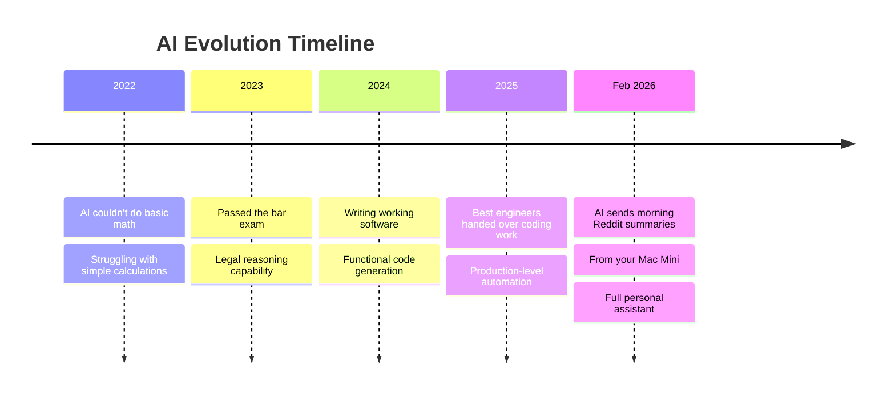

## Ingat Tahun 2014? 🌯

Bayangkan ini: Tahun 2014, kalau kamu mau makan burrito, kamu harus:
1. **Masuk ke mobil** 🚗
2. **Nyetir ke restoran** 🏪
3. **Antri** 😤
4. **Ngomong sama orang** 💬

Sekarang coba bayangin kalau ada yang bilang: *"Suatu hari nanti, seorang stranger bakal bawa burrito ke depan rumahmu cuma karena kamu pencet tombol di HP."*

Kamu pasti mikir: **"Itu kedengarannya distopia sekaligus luar biasa."** 😱

Dan tahu nggak? **Dalam waktu sekitar 3 tahun**, itu jadi **normal aja**. Biasa. Bahkan nggak kita pikirin lagi. 

<Callout type="quote" title="John Palmer">
"Then, over the course of about three years, it just became normal."
</Callout>

Oh iya, ini juga terjadi **sebelum** Chipotle mulai pelit sama porsinya. Jadi dulu emang beneran enak. 😅

---

## Kita Ada di Titik yang Sama — Tapi Kali Ini Bukan Burrito 💼

John Palmer, seorang product person yang kerja di dunia crypto, bilang: **Kita sekarang ada di inflection point yang sama persis.**

Bedanya? **Bukan burrito yang berubah. Tapi seluruh cara kita kerja.** 🧑‍💻

Dia menghabiskan dua minggu terakhir:
- **Baca tentang AI** 📚
- **Nonton video orang bikin sesuatu pakai AI** 📹
- Dan sekarang dia bilang: *"I live in this world now."* 🌍

Masa depan sedang dibentuk oleh **sekelompok kecil orang** — beberapa ratus peneliti di beberapa perusahaan. Dan John? Dia bukan salah satunya. Dia kerja di **crypto**. 

Tapi dia cukup dekat untuk **merasakan tanahnya bergetar**. 🌊

<Callout type="important" title="Proximity to Change">
"I am close enough to feel the ground shake."

— John Palmer
</Callout>

Dan bukti bahwa dia serius? **Dia baru aja beli Mac Mini.** 💻

Belum di-setup sih. Tapi coba pahami maksudnya. 😏

---

## Ini Bukan Prediksi — Ini Sudah Terjadi pada Orang Lain 👀

> **Inilah yang orang di luar dunia tech belum paham:**  
> Orang-orang yang teriak-teriak soal AI **bukan lagi bikin prediksi.**  
> Mereka **ngasih tahu kamu apa yang udah terjadi pada mereka.** 🚨

John cuma **relay informasi ini, secondhand, tapi dengan keyakinan penuh.**

Selama bertahun-tahun, AI berkembang **steady**. Tapi John nggak terlalu notice karena dia **nggak beneran perhatiin**, to be honest. 😅

Terus tiba-tiba di **2025**, semuanya jadi **jauh lebih cepat**. Dan terus **makin cepat lagi**. ⚡

Dia tahu ini karena dia nonton **podcast 3 jam** tentang ini Rabu lalu. Host-nya terlihat **ketakutan**. John tahu karena host itu bahkan **nggak bisa ngabisin satu pint Guinness.** 🍺😨

---

## 5 Februari 2026: Hari yang Mengubah Segalanya? 📅

Terus tanggal **5 Februari**, dua lab AI besar rilis model baru **di hari yang sama**. Dan sesuatu **klik**.

Bukan buat John personally — dia lagi di **birthday dinner temen istrinya**. 🎂

Tapi buat orang-orang yang **nyobain model itu hari itu**, itu **huge deal**. 🔥

<Callout type="example" title="Real Use Case">
"Satu orang bilang dia tinggal kasih tau AI-nya apa yang mau dibikin, **jalan selama 4 jam**, terus balik lagi dan kerjaan udah selesai."
</Callout>

Dan John bilang: **"This will very likely be what my life is like as well."** 🤯

Setelah dia setup Mac Mini-nya, AI bakal ngerjain sesuatu **sementara dia di ruangan sebelah**. Dan itu **potentially huge**. 💥

---

## Contoh Konkret: Build App Cuma dengan Ngomong 🛠️

Ada orang di Twitter yang **bikin app lengkap cuma dengan deskripsi**.

AI:
1. **Nulis code** ✍️
2. **Buka app-nya** 📱
3. **Tes tombol-tombolnya** 🔘
4. **Ngerasa layout-nya kurang oke** 🤔
5. **Benerin sendiri** 🔧
6. **Baru bilang: "It's ready."** ✅

John juga mau bikin sesuatu kayak gitu pakai Mac Mini-nya. Mungkin **app keren atau sesuatu**, dia masih mikir. Tapi yang pasti:
- **Hardware udah ada.** 💻
- **Dia pasti bakal optimasi setupnya** pakai segala macam skills dan plugins. 🔌

Dan ini bukan lebay. **Itu literally bisa jadi Selasa-nya John.** Potentially. 😎

---

## "Tapi Gue Udah Coba AI dan Nggak Sebagus Itu Kok" 🤨

John **sering banget** denger ini. Dan dia paham, karena dia juga **mikir gitu**.

Tapi **model hari ini udah nggak bisa dikenali** dibanding 6 bulan lalu. 🚀

Beberapa orang yang bilang gini punya **ratusan ribu followers**. Tapi mereka **masih stuck** di pengalaman lama.

<Callout type="warning" title="Pro Tip">
**Pastiin kamu nggak pakai free plan.** Kamu **harus langganan yang berbayar**. 💳
</Callout>

Karena perbedaan antara **free tier** dan **paid tier** itu bukan cuma sedikit. Ini **beda dunia**. 🌍

---

## Seberapa Cepat Ini Terjadi? Timeline 2022–2026 📊

Mari kita lihat **seberapa cepat** perkembangan ini:



**Dari nggak bisa ngitung → lulus ujian pengacara → nulis software → jadi asisten pribadi.**

Semuanya dalam waktu **kurang dari 4 tahun**. 🤯

<Callout type="danger" title="Kecepatan Eksponensial">
Ini bukan pertumbuhan **linear**. Ini **eksponensial**. Dan kebanyakan orang **belum nyadar**. ⏱️
</Callout>

---

## Ini Bukan Tentang "Apakah" — Ini Tentang "Kapan" ⏳

Yang paling menarik dari tulisan John adalah **dia nggak bilang ini bakal terjadi.**

Dia bilang: **"Ini udah terjadi pada orang lain. Dan bentar lagi giliran gue."** 🎯

Dia bahkan udah **beli hardware-nya**. Mac Mini. Belum di-setup, tapi **udah siap**. 💻✨

Dan kalau kamu pikir ini cuma **hype** atau **over-exaggeration**, coba inget:
- **2014**: "Stranger bawa burrito ke rumah kamu" = sounds crazy
- **2017**: DoorDash, Uber Eats, GrubHub = biasa aja 🍕

**Perubahan teknologi nggak datang dengan teriakan.**  
Mereka datang **pelan-pelan, lalu tiba-tiba jadi normal.** 🌊

---

## Apa Artinya Ini Buat Kita? 🧠

### 1. **Kita Lagi di Awal Sesuatu yang Besar** 🚀

Kalau kamu merasa **ketinggalan**, kamu nggak sendiri. Bahkan orang yang kerja di dunia tech juga **baru mulai nyadar**.

Tapi yang penting: **Kamu masih punya waktu untuk prepare.** ⏰

### 2. **Skill yang Penting Bukan "Cara Nulis Code"** 🧑‍💻

Skill yang bakal penting:
- **Cara komunikasi yang jelas** sama AI 💬
- **Critical thinking** buat evaluasi output AI 🧐
- **Creativity** buat tahu **apa** yang mau dibikin 🎨
- **Problem-solving** buat tahu **kenapa** sesuatu penting 🤔

### 3. **Mac Mini Bukan Intinya — Mindset-nya Itu** 🧠

John cerita tentang Mac Mini karena itu **simbol**. Dia **serius**. Dia **prepare**. Dia **aware**. 👀

Kamu nggak perlu beli Mac Mini. Tapi kamu perlu **mulai eksperimen**. Mulai **coba**. Mulai **belajar**. 📚

<Callout type="tip" title="Action Steps">
1. **Upgrade ke paid plan** di AI tool pilihanmu (ChatGPT, Claude, Gemini)
2. **Coba daily** — jangan cuma buat fun, tapi buat **kerjaan nyata**
3. **Follow orang yang lagi build** — lihat apa yang mereka bikin
4. **Document journey-mu** — biar kamu bisa lihat progress
</Callout>

---

## Kesimpulan: Something Small is Happening 🌱

Judulnya **"Something Small"** tapi isinya **huge**. Dan itu **ironi yang disengaja**. 😏

Karena **perubahan besar** selalu dimulai dari **hal kecil yang nggak kelihatan**.

- Tahun 2014: **Burrito delivery** = hal kecil
- Tahun 2026: **AI doing your job** = hal kecil... yang bakal jadi **normal dalam 3 tahun**

**Groundnya udah mulai bergetar.** 🌊  
**Sekelompok kecil orang udah ngerasain.**  
**Dan sebentar lagi giliran kita.**

<Callout type="question" title="Pertanyaan Buat Kamu">
**Kamu mau jadi orang yang:**
- **Ngerasain getarannya duluan?** 🏃‍♂️
- **Atau nunggu sampai jadi normal, baru mulai?** 🐢

Nggak ada jawaban yang salah. Tapi **sadar** bahwa **kamu punya pilihan**. 💡
</Callout>

---

## Penutup: Setup Your Mac Mini 🖥️

Oh, dan John? Dia **belum setup Mac Mini-nya**. 😅

Tapi **dia pasti akan**. Dan ketika dia setup, **hidupnya bakal berubah**.

Dan kamu? **Apa yang kamu tunggu?** 🚀

---

> **"I haven't set it up yet, but I think you can understand what I'm saying."**  
> — John Palmer

**TL;DR:**  
Perubahan teknologi datang **pelan**, lalu **tiba-tiba jadi normal**. Burrito delivery butuh 3 tahun. AI replacing jobs? **Lagi terjadi sekarang**. Kamu masih punya waktu — tapi **nggak banyak**. ⏱️💥

---

<Callout type="info" title="Referensi">
Tweet thread asli oleh **John Palmer** (@johnpalmer) — 12 Februari 2026.

Artikel ini adalah **interpretasi dan ekspansi** dari tweet thread tersebut dengan sudut pandang dan analisis tambahan.
</Callout>

---

## What You Should Actually Do 🎯

Ini bukan buat nakut-nakutin kamu. Ini ditulis karena **keuntungan terbesar yang kamu punya sekarang adalah: jadi early adopter.** ⏰

Early untuk **paham**. Early untuk **beli hardware**. Early untuk **subscribe paid tier** dan minta AI bikinin meal plan. 🍽️

### 1. Mulai Pakai untuk Kerjaan Nyata 💼

**Jangan cuma main-main.** Kasih AI **kerjaan sungguhan**:

- **Engineer?** Kasih GitHub repo 🧑‍💻
- **Finance?** Kasih spreadsheet yang berantakan 📊
- **Industri lain?** Figure out apa yang bisa kamu kasih — **terus kasih itu** 🎯

<Callout type="tip" title="Kalau Belum Tahu Apa yang Mau Dikasih">
**Kasih aja sesuatu.** Pokoknya **kasih**. 💪
</Callout>

Kalau kamu bilang: *"Gue butuh mikir dulu..."* 🤔

**Stop.** Jangan mikir lama-lama. **Mulai sekarang.** ⚡

---

### 2. Mention ke Coworkers-mu 🗣️

Sekarang ada **window singkat** di mana kebanyakan orang masih **ignore** ini.

Kamu bisa jadi **orang yang ignore-nya lebih dikit** — dan itu **bikin kamu unggul**. 🏆

**Jadi orang yang masuk meeting dan bilang:**  
*"Gue pakai AI buat analisis ini dalam 1 jam, bukannya 3 hari."*

<Callout type="quote">
"It's fine if it took you three days actually. The point is, **people will respect you.**"
</Callout>

Hasil: **Respect.** ✊

---

### 3. Get a Mac Mini 💻

**"I think this one speaks for itself."**

Setiap akun yang posting tentang ini punya **Mac Mini**. Literally. 🖥️

Ini **ultimate tool** buat hal ini. Period.

<Callout type="important" title="Mac Mini = Simbol Keseriusan">
Ini bukan cuma hardware. Ini **statement**: "Gue serius. Gue ready. Gue nggak cuma ngomong." 🎯
</Callout>

---

### 4. Get Your Financial House in Order 💰

John bukan financial advisor. Tapi dia baru aja spending:
- **$599** untuk Mac Mini (+ AppleCare) 🖥️
- **$50** untuk Claude tokens 🤖

Dan kalau terlalu mahal? **Punya backup plan**: switch ke **open source Chinese model**. 🇨🇳

Intinya: **Prepare financially.** Ini investment, bukan expense. 📈

---

### 5. Watch the Podcasts — No, STUDY Them 🎧

Jangan cuma nonton. **Study.** 📚

- **TBPN** (The Big Picture Network)
- **Dwarkesh**
- Dan lain-lain

**Good news:** Podcast-podcast ini **beberapa jam panjangnya**, jadi kamu bisa **isi hari kamu** cuma dengan nonton mereka. 😏

<Callout type="tip" title="Pro Tip">
Treat podcast AI kayak **kursus online gratis**. Ambil notes. Rewatch. Implement. 🎓
</Callout>

---

### 6. Rethink What You're Telling Your Kids 👶

Standard playbook:
- **Good grades** 📝
- **Good college** 🎓
- **Stable job** 💼

**It's over.** ❌

Kasih tau anak-anak (atau adik, atau siapa aja yang masih muda):  
**"It's likely not looking good for them."**

Bukan buat nakut-nakutin. Tapi buat **prepare mereka** buat dunia yang **beda banget**. 🌍

<Callout type="warning" title="Harsh Truth">
Dunia yang kita persiapkan untuk generasi sebelumnya **sudah nggak berlaku** untuk generasi sekarang. 🚨
</Callout>

---

## What John Knows for Sure ✅

### 1. This Isn't a Fad 🚀

Teknologinya **works**. Dan institusi terkaya di dunia **pour trillions** ke dalamnya. 💸

John tahu ini karena dia **udah sering banget lihat** dalam beberapa bulan terakhir. 👀

### 2. Yang Bakal Menang: Early Engagers 🏁

Orang-orang yang bakal **come out best** dari semua ini adalah yang **mulai engage sekarang**.

**Bukan dengan rasa takut.**  
Tapi dengan:
- **Curiosity** 🤔
- **Sense of urgency** ⏱️
- Dan **idealnya, Mac Mini** 🖥️

<Callout type="success" title="The Winning Combo">
**Curiosity + Urgency + Mac Mini = Success** 🎯
</Callout>

---

## The Future is Already Here 🌅

> **"The future is already here. It just hasn't knocked on your door yet."**

Dan ketika future itu **knock**, John bakal **ready**. ✊

- **Mac Mini-nya bakal di-unbox** 📦
- **Agent-nya bakal dikonfigurasi** ⚙️
- **Dia bakal describe apa yang dia mau, in plain English** 💬
- **Dan itu bakal appear** ✨

Cuma satu masalah: **Dia harus optimize dulu** dan pastiin **setup-nya super legit**. 😅

<Callout type="question" title="Dan Kamu?">
**Apakah kamu akan ready ketika future knocks?** 🚪

Atau kamu bakal **buka pintu** terus bilang:  
*"Wait, gue belum setup... Mac Mini-nya masih di box..."* 📦😰
</Callout>

---

## If This Resonated with You... 💬

**Share** ini dengan seseorang yang **should be thinking about this**. 🗣️

Kebanyakan orang **nggak akan denger** sampai **terlalu terlambat**. ⏳

**Kamu bisa jadi alasan** seseorang yang kamu peduli **beli Mac Mini**. 💻❤️

<Callout type="important" title="John Palmer's Bio">
**John Palmer** (@johnpalmer)  
Senior Idea Guy @ Area Technology & Pretty DAO

Dia kerja di **crypto**, bukan AI. Tapi dia **cukup dekat untuk ngerasain getarannya**. 🌊
</Callout>

---

## Refleksi Akhir: Action Over Perfection 🎬

Yang paling **powerful** dari tulisan John adalah ini:

**Dia belum setup Mac Mini-nya.** 😅

Tapi **dia udah beli**. Dia udah **commit**. Dia udah **decided** bahwa dia bakal **engage** dengan future ini. 🚀

**Kamu nggak perlu perfect.**  
**Kamu nggak perlu udah jadi expert.**  
**Kamu cuma perlu START.** ⚡

---

### Action Checklist (Copy This!) ✅

```markdown
- [ ] Subscribe ke paid tier AI tool (ChatGPT Plus, Claude Pro, Gemini Advanced)
- [ ] Kasih AI satu kerjaan nyata dari pekerjaanmu
- [ ] Mention AI ke satu coworker minggu ini
- [ ] Watch minimal satu podcast AI (TBPN / Dwarkesh)
- [ ] Consider: apakah Mac Mini (atau equivalent) worth it buat setupmu?
- [ ] Share artikel ini ke satu orang yang perlu baca ini
```

---

## Pesan Terakhir 💌

**Something small is happening.**

Tapi **"small"** ini bakal jadi **normal** dalam 3 tahun. 📅

Dan ketika itu **normal**, yang **early** akan jadi **leaders**. 👑  
Yang **late** akan jadi... **followers**. 🐑

**Pilihan ada di tanganmu.** 🖐️

**Unbox your Mac Mini.** 📦  
**Configure your agent.** ⚙️  
**Describe what you want.** 💬  
**And watch it appear.** ✨

---

<Callout type="success" title="You Got This! 💪">
Future-nya udah di sini. Tinggal kamu yang decide:

**Mau jadi orang yang ngerasain duluan?**  
**Atau orang yang nyadar belakangan?**

Either way is fine. Tapi **be conscious** tentang pilihanmu. 🧠
</Callout>

---

**Now go. Setup your Mac Mini.** 🖥️✨

*(Atau equivalent-nya. Seriously, Mac Mini bukan magic. Tapi commitment-mu? That's the magic.)* 🪄
