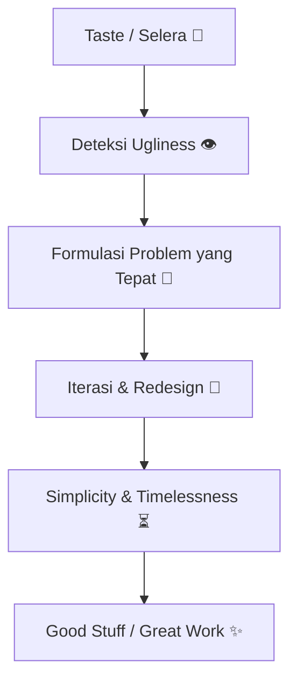

## Pembuka: MIT, Aplikasi Menumpuk, Tapi… Ada yang Hilang 🧑‍🏫📩

Paul Graham membuka esai ini dengan cerita sederhana: seorang teman yang mengajar di MIT kebanjiran pendaftar graduate. Banyak yang terlihat pintar. Tapi si dosen bingung dengan satu hal:

<Callout type="quote" title="Pertanyaan yang Menohok">
"A lot of them seem smart... What I can't tell is whether they have any kind of taste."
</Callout>

Kata **taste** (selera) sekarang jarang terdengar—apalagi di dunia yang serba *metrics*, angka, ranking, dan sertifikat. Tapi Graham bilang: kita tetap butuh konsep ini, mau kita sebut apa pun. Karena untuk jadi *maker* (pembuat)—engineer, designer, penulis, arsitek, musisi—kita bukan sekadar teknisi. Kita harus bisa **mendesain sesuatu yang “bagus”**. Dan “bagus” itu seringkali identik dengan satu kata: **beautiful**. ✨

Di titik ini, Graham mengajukan pertanyaan yang terasa filosofis, tapi sebenarnya sangat praktis:

- Apakah “indah” di matematika sama dengan “indah” di arsitektur? 🧮🏛️
- Apakah ada prinsip lintas-bidang yang bisa dipakai? 🔄
- Kalau iya… **bagaimana cara bikin good stuff**? 🛠️

---

## “Taste Itu Subjektif” — Kalimat yang Kelihatan Benar, Tapi Menjebak 🪤

Banyak orang akan bilang: *taste itu subjektif*. Graham paham kenapa orang merasa begitu. Karena saat seseorang suka sesuatu, seringkali ia nggak bisa menjelaskan alasannya. Bisa jadi karena:

- memang indah ✨
- nostalgia ("ibu saya punya barang itu") 🧸
- pengaruh selebriti 📰
- sinyal status (mahal = terlihat bagus) 💸

Campur aduk. Impuls yang tidak diperiksa. Dan sejak kecil, kita sering “didamaikan” dengan setengah-kebenaran: *"kamu suka caramu, adikmu suka caranya"*. Itu berguna buat stop ribut. Tapi itu bukan pelajaran estetika. 😅

Yang lucu (dan agak tragis): setelah anak dijejali relativisme, ia dibawa ke museum dan diberitahu bahwa Leonardo itu “great artist”. Anak itu bingung—kalau semua selera valid, *great* itu maksudnya apa? “Bagus untukmu” seperti brokoli? 🥦

<Callout type="important" title="Poin Utama Graham">
Kalau taste cuma preferensi personal, maka **nggak ada konsep ‘lebih baik’**. Dan kalau tidak ada ‘lebih baik’, maka untuk pekerjaan desain… **nggak ada cara untuk berkembang.** 📉
</Callout>

Padahal kenyataannya, *maker* yang serius pasti merasakan:

- kamu latihan → kamu membaik 📈
- seleramu berubah 🎛️
- kamu tahu seleramu membaik (karena kamu melihat kesalahan lama) 🔍

Kalau selera bisa membaik, berarti selera bisa salah. Dan itu meruntuhkan mantra: *taste can’t be wrong*. 💥

---

## Taste = Kompas untuk “Good Design” 🧭✨

Begitu kita berani mengakui ada desain baik dan buruk (setidaknya untuk diri sendiri), Graham mengajak kita untuk **mempelajari good design secara konkret**.

Menariknya: saat kita bandingkan berbagai bidang, prinsip-prinsip “keindahan” itu mirip. Seolah ada pola universal. Berikut inti prinsip-prinsip yang Graham jabarkan—dan saya tambahkan penjelasan praktisnya untuk dunia produk & software. 🤖

---

## 1) Good Design is Simple 🧼

“Simpel” bukan berarti dangkal. Simpel berarti:

- bukti matematika lebih pendek sering lebih baik 🧮
- program lebih kecil sering lebih mudah dipahami 🧑‍💻
- desain produk mengandalkan struktur utama, bukan ornamen tempelan 🎨
- tulisan bilang yang penting dengan ringkas ✍️

Kenapa orang gagal jadi sederhana? Karena saat kreatif, orang sering panik. Lalu lari ke:

- kata-kata bombastis 🗣️
- *swoosh* dan *curlicue* desain 🎀
- gaya “ekspresif” yang menutupi kekosongan 🎭

<Callout type="warning" title="Sederhana Itu Menakutkan">
Saat kamu dipaksa sederhana, kamu dipaksa menghadapi masalah sebenarnya. Dan itu yang bikin banyak orang kabur ke ornamen. 😬
</Callout>

---

## 2) Good Design is Timeless ⏳

Hardy bilang: *nggak ada tempat permanen untuk matematika yang jelek*. Maksudnya mirip dengan prinsip Kelly Johnson (Skunk Works):

- kalau jelek, kemungkinan besar **bukan solusi terbaik**
- selalu ada solusi lebih elegan yang suatu hari akan ditemukan

Aiming for timelessness itu strategi memaksa diri menuju jawaban terbaik:

- kalau kamu bisa membayangkan orang lain mengalahkan solusimu, **kamu harus mengalahkan dirimu sendiri dulu** 🥊

Selain itu, timelessness membantu kita lepas dari mode:

- fashion berubah-ubah 👗
- merit bertahan 🪨

Trik menarik: kalau mau tahan lama, coba bikin sesuatu yang juga akan disukai orang di 1500. Karena masa depan akan cuek dengan tren hari ini. 🕰️

---

## 3) Good Design Solves the Right Problem 🎯

Ini favorit saya karena langsung nyambung ke UX.

Graham memberi contoh kompor: 4 tungku berbentuk kotak. Kalau tombolnya kamu susun lurus, itu “simpel”… tapi menjawab pertanyaan yang salah. Manusia harus mikir: tombol ini untuk tungku mana? 🤯

Solusi yang benar: susun tombol dalam kotak yang sama dengan tungku. ✅

<Callout type="tip" title="Heuristik Praktis">
Kalau desainmu bikin user harus “berhenti dan berpikir” untuk mapping sederhana, biasanya itu tanda kamu menyelesaikan masalah yang salah. 🧠
</Callout>

Graham juga menyinggung: sering kali bukan hanya solusi yang diperbaiki—**problem-nya juga bisa diganti**.

Dalam software: masalah yang “susah” sering bisa diubah menjadi masalah ekuivalen yang “mudah” dengan framing yang lebih tepat. 🧩

---

## 4) Good Design is Suggestive (Memberi Ruang) 🧱🧠

Jane Austen hampir tak memberi deskripsi; ia bercerita sehingga pembaca membayangkan sendiri. Lukisan yang “menyarankan” sering lebih menarik daripada yang “menjelaskan semuanya”.

Di produk & software, ini berarti:

- berikan elemen dasar yang bisa dikombinasikan user (Lego) 🧱
- jangan paksa user hidup di dalam “program” si desainer 😅

Software bagus bukan yang mengurung—tapi yang membuka kemungkinan. 🔓

---

## 5) Good Design is Often Slightly Funny 🙂

Graham bilang ini mungkin tidak selalu benar, tapi sering terlihat: karya kuat sering punya humor halus.

Kenapa humor nyambung ke desain bagus?

- humor tanda kekuatan 💪
- yang kuat tidak terlalu serius pada dirinya sendiri 😌

Humor kecil memberi sinyal: "aku menguasai ini." Bukan gugup. Bukan defensif. ✅

---

## 6) Good Design is Hard (Tapi Hard yang Benar) 🧗

Karya hebat hampir selalu lahir dari kerja keras. Tapi Graham membedakan:

- **good pain**: seperti lari 🏃
- **bad pain**: seperti menginjak paku 🧷

Masalah yang sulit bisa memaksa elegansi: kamu membuang yang tidak perlu, fokus pada inti. Seperti mendaki gunung: kamu cuma bawa yang penting. 🎒

---

## 7) Good Design Looks Easy (Padahal Tidak) 🧊

Tulisan yang terasa santai sering lahir dari revisi ke-8. ✍️

Karya engineering yang terlihat "kok gitu doang" itu biasanya hasil:

- iterasi panjang 🔁
- rasa (taste) yang tajam ✨
- ketelitian ekstrem 🧷

Dan ini penting: **kemudahan yang tampak** adalah sinyal kualitas, bukan kebetulan. Tapi kamu tidak bisa “memalsukan” ease tanpa kerja keras.

---

## 8) Good Design Uses Symmetry 🌿

Simetri sering jadi jalan menuju kesederhanaan. Ada dua jenis:

- repetisi 🔁
- rekursi 🌿 (pola di dalam pola, seperti urat daun)

Dalam software:

- rekursi/induksi sering membuat solusi pendek dan kuat 🧠

Tapi hati-hati: simetri juga bisa jadi pengganti pemikiran. Repetisi bisa jadi “ornamen” versi lain kalau kamu mengulang tanpa alasan. ⚠️

---

## 9) Good Design Resembles Nature 🐚

Bukan karena meniru alam selalu benar, tapi karena alam punya waktu evolusi yang sangat panjang untuk “menguji” solusi. Kalau desainmu mirip alam, itu pertanda baik.

Dan ini bukan hanya bentuk—tapi juga metode:

- sekarang kita punya komputasi untuk meniru *cara* alam menemukan desain (genetic algorithms) 🧬

---

## 10) Good Design is Redesign 🔁🧠

Jarang ada desain yang langsung benar di versi pertama. Orang ahli mengharapkan mereka akan membuang draft awal. Itu butuh confidence.

Leonardo menggambar ulang garis sampai 5–6 kali. Open-source punya lebih sedikit bug karena ia “mengakui bug itu mungkin ada”—jadi bug mudah ditemukan dan diperbaiki. 🐛✅

<Callout type="important" title="Sistem yang Membuat Perubahan Murah">
Medium yang bagus adalah yang membuat revisi **murah dan aman** (sketch, git, prototyping). Karena redesign bukan anomali—itu default. 🔁
</Callout>

---

## 11) Good Design Can Copy (dengan Cara yang Dewasa) 📚

Perjalanan umum:

1) pemula meniru tanpa sadar 🙈
2) lalu memaksa original 🎭
3) akhirnya sadar: lebih penting benar daripada original ✅

Master yang matang tidak insecure untuk mengambil yang terbaik dari siapa pun. Mereka percaya identitasnya tidak akan hilang. Justru akan muncul secara natural.

---

## 12) Good Design is Often Strange 👽

Beberapa karya terbaik terasa “aneh tapi indah”: Euler’s formula, SR-71, Lisp. Graham bilang: jangan mengejar keanehan. Keanehan sering muncul sebagai konsekuensi dari kejujuran terhadap kebenaran.

Einstein tidak berusaha membuat relativitas terasa aneh. Ia berusaha membuatnya benar. Dan kebenaran ternyata aneh. 🌀

---

## 13) Good Design Happens in Chunks (Ekosistem Itu Penting) 🏙️

Graham menyoroti Florence abad ke-15: begitu banyak jenius berkumpul di satu tempat dan waktu.

Pelajarannya: kualitas bukan hanya DNA, tapi **komunitas dan konteks**.

Hotspots modern: Bauhaus, Manhattan Project, Skunk Works, Xerox PARC. Tempat-tempat ini menciptakan atmosfer di mana taste dan craft saling mempercepat. 🚀

---

## 14) Good Design is Often Daring 🦁

Setiap era punya “kebenaran” yang ternyata konyol. Dan sering butuh keberanian untuk mengatakan: *ini tidak masuk akal*.

Tempat terbaik untuk mencari terobosan: titik di mana konvensi dan kebenaran tidak sepenuhnya bertemu. 👀

---

## Epilog: Lebih Mudah Melihat Jelek daripada Membayangkan Indah 👁️

Graham menutup dengan ide yang sangat praktis:

- banyak karya besar lahir karena seseorang melihat sesuatu dan berkata: **"What a hack. There must be a better way."** 😤

Tapi “intoleransi terhadap keburukan” saja tidak cukup. Kamu harus memahami bidangnya dulu agar hidungmu tajam. Lalu rawat suara kecil itu. Karena resep karya besar adalah:

<Callout type="success" title="Resep Great Work">
**Very exacting taste + ability to gratify it** ✨🛠️
</Callout>

---

## Diagram Ringkas: Taste → Design → Great Work 🗺️

---

## Checklist Praktis untuk Maker (Mulai Besok) ✅📌

Kalau kamu engineer/designer/penulis, ini latihan konkret untuk membangun taste:

1. **Koleksi contoh “bagus”** (bukan banyak, tapi tajam) 📚
2. **Bedah kenapa bagus** (simpel? timeless? solve right problem?) 🔍
3. **Buat versi kecil** (replikasi secara sadar = belajar) 🧪
4. **Redesign cepat** (jadikan revisi murah: sketch, prototype, git) 🔁
5. **Cari “hack” yang mengganggumu** di pekerjaanmu lalu perbaiki satu per satu 🛠️
6. **Minta feedback dari orang yang taste-nya kamu hormati** 🧑‍⚖️

<Callout type="note" title="Catatan Kecil">
Taste berkembang bukan karena kamu "punya bakat"—tapi karena kamu terus-menerus melihat contoh bagus, mencoba, gagal, membetulkan, lalu mengulang. 🔁✨
</Callout>

---

## Referensi 🔗

- Paul Graham — **Taste for Makers** (Feb 2002)
- Kutipan pembuka:
  - Thomas Kuhn, *The Copernican Revolution*
  - Ben Rich, *Skunk Works*
  - G. H. Hardy, *A Mathematician's Apology*

