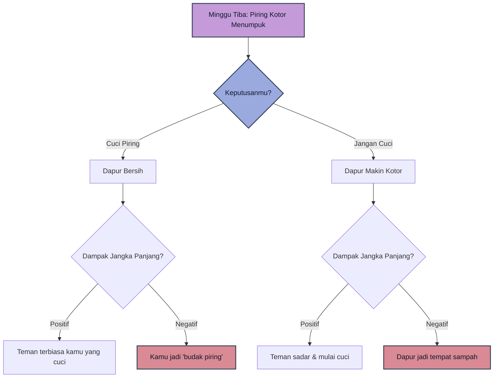
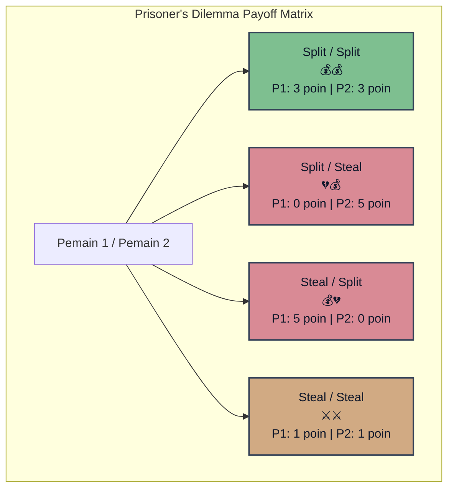
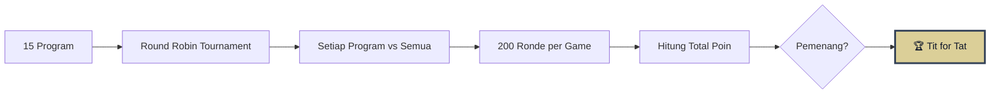
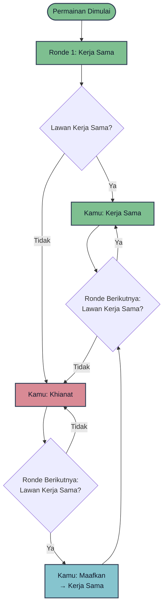
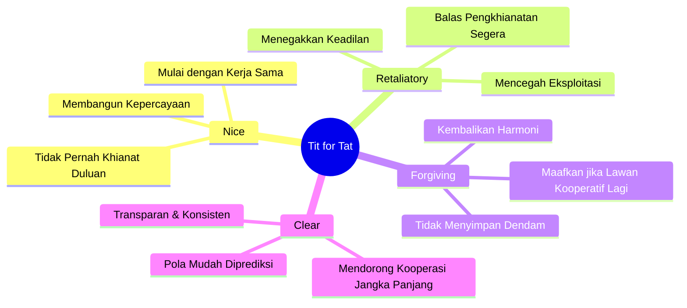
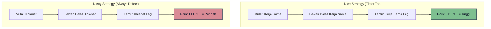
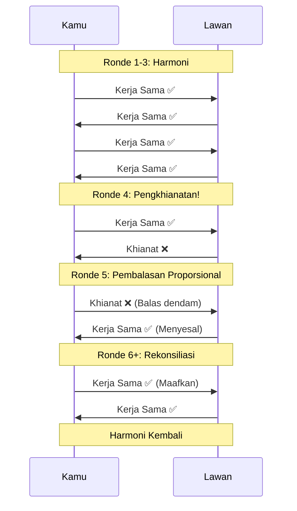
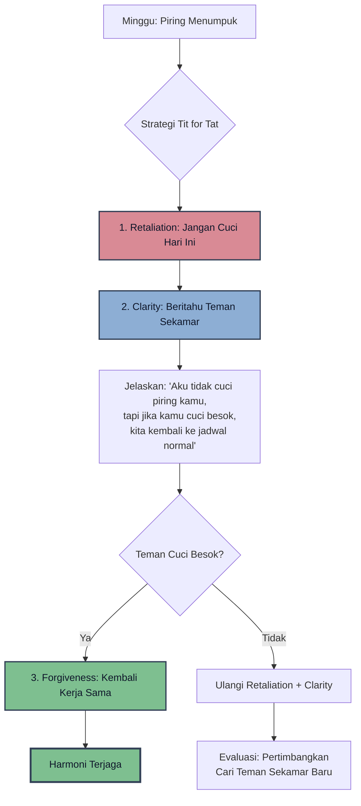

## Pendahuluan: Dilema Piring Kotor yang Mengubah Segalanya 🍽️💭

Bayangkan ini: Kamu baru saja pindah ke apartemen kecil bersama seorang teman baru. Untuk menjaga keharmonisan, kalian sepakat membagi tugas rumah tangga—termasuk **mencuci piring**. Kamu ambil hari Minggu, dia ambil hari Rabu.

Semua berjalan lancar selama beberapa minggu. Hingga suatu Rabu, kamu pulang dan menemukan tumpukan piring kotor memenuhi bak cuci. Kamu berpikir, *"Mungkin dia lupa, besok pasti dicuci."* 🤷

Tapi besoknya? Tumpukan itu makin tinggi. Dan makin tinggi lagi. Sampai hari Minggu tiba, dan kamu dihadapkan pada dilema:

**Apakah kamu mencuci piring itu atau membiarkannya menumpuk?** 🤔

- Jika kamu mencuci, apakah kamu sudah menjadi "budak piring" selamanya?
- Jika kamu tidak mencuci, apakah dapur akan menjadi tempat pembuangan sampah?
- Bagaimana cara terbaik menghadapi teman sekamar yang seperti ini?

Inilah yang disebut **Prisoner's Dilemma** dalam kehidupan nyata—sebuah situasi di mana dua pihak seharusnya bekerja sama, tapi masing-masing punya insentif untuk **mengkhianati yang lain**. Dan ilmu yang mempelajari ini disebut **Game Theory** (Teori Permainan). 🎮🧠

---

## Apa Itu Game Theory? 🎲📊

Game Theory adalah **studi matematis tentang pengambilan keputusan** dalam situasi di mana hasilnya bergantung pada pilihan orang lain.

Secara lebih spesifik, Game Theory memeriksa bagaimana **konflik dan kerja sama** di antara pengambil keputusan yang rasional dapat menghasilkan hasil yang optimal—atau justru suboptimal.

<Callout type="info" title="Definisi 'Game' dalam Game Theory">
Dalam konteks ini, **"game"** bukan hanya permainan tradisional seperti catur atau poker. Melainkan **setiap interaksi** antara dua pihak atau lebih di mana keputusan yang dibuat oleh satu pihak **memengaruhi hasil bagi pihak lain**.

Ini mencakup hampir semua hal:
- Bisnis & negosiasi 💼
- Politik & diplomasi 🌍
- Hubungan personal 💑
- Ekonomi & perdagangan 💰
</Callout>

### Cooperative vs Non-Cooperative Games

Game Theory membedakan dua jenis interaksi:

| **Cooperative Games** | **Non-Cooperative Games** |
|-----------------------|----------------------------|
| Tujuan bersama (tim olahraga, kemitraan bisnis) | Tujuan berlawanan (kompetisi, perang) |
| Sumber daya & informasi dibagi | Setiap orang bertindak untuk dirinya sendiri |
| Fokus pada keadilan & manfaat bersama | Fokus pada kemenangan individu |

**Kenyataannya?** Sebagian besar kehidupan kita berada di zona **Non-Cooperative Games**—di mana kita harus membuat keputusan yang menguntungkan diri sendiri, tapi juga harus memperhitungkan reaksi orang lain. 🧩

---

## Golden Balls: Game Show yang Mengajarkan Teori Permainan 🎰💰

Di akhir tahun 2000-an, sebuah acara game show Inggris bernama **Golden Balls** mendemonstrasikan Prisoner's Dilemma dengan cara yang sangat dramatis.

**Aturan mainnya sederhana:**
Dua orang asing duduk berhadapan. Mereka harus memilih antara **Split** (Bagi) atau **Steal** (Curi) untuk mendapatkan sejumlah uang besar. Keputusan mereka baru diumumkan setelah keduanya sudah mengunci pilihan.

**Hasil yang mungkin:**

| Pilihan Pemain 1 | Pilihan Pemain 2 | Hasil Pemain 1 | Hasil Pemain 2 |
|------------------|------------------|----------------|----------------|
| **Split** | **Split** | 50% uang | 50% uang |
| **Split** | **Steal** | 0% uang | 100% uang |
| **Steal** | **Split** | 100% uang | 0% uang |
| **Steal** | **Steal** | 0% uang | 0% uang |

### Visualisasi Payoff Matrix (Matriks Hasil) 📊

<Callout type="warning" title="Strategi Dominan">
Dalam situasi **one-off** (sekali main tanpa pengulangan), teori permainan menunjukkan bahwa pilihan rasional adalah **selalu Steal**.

**Mengapa?**
- Jika lawan memilih Split → kamu menang 100%
- Jika lawan memilih Steal → kamu tetap dapat 0%, tapi tidak dimanfaatkan

Ini disebut **Dominant Strategy** — pilihan yang memberikan hasil terbaik apa pun yang dilakukan lawan. 🎯
</Callout>

**Tapi kehidupan bukan game show.** 🌍

Interaksi kita hampir tidak pernah one-off. Keputusan kita hari ini memengaruhi hubungan kita besok, minggu depan, bahkan tahun depan. Jadi, apa strategi terbaik untuk **kehidupan nyata**? 🤔

---

## Turnamen Axelrod: Mencari Strategi Terbaik 🏆🤖

Pada tahun **1980**, ilmuwan politik **Robert Axelrod** mengadakan eksperimen brilian untuk menjawab pertanyaan ini.

Dia mengundang para ahli teori dari berbagai disiplin ilmu dan negara untuk mengirimkan **program komputer** yang akan berkompetisi dalam turnamen Prisoner's Dilemma yang diulang-ulang (*iterated*).

### Aturan Turnamen

**Setiap program bermain melawan:**
- Semua program lain
- Salinan dirinya sendiri

**Poin per ronde:**
- Keduanya kerja sama: masing-masing **3 poin**
- Satu kerja sama, satu khianat: yang khianat **5 poin**, yang kerja sama **0 poin**
- Keduanya khianat: masing-masing **1 poin**

**Total ronde per game:** 200 putaran

**Tujuan:** Kumpulkan poin sebanyak mungkin di akhir semua pertandingan.

---

### Program yang Ikut 🤖

Ada **14 program** yang dikirimkan, ditambah 1 program acak dari Axelrod sendiri.

**Beberapa contoh strategi:**
- **Grass Camp** 🦅: Mencari kelemahan lawan, lalu mengeksploitasinya tanpa ampun.
- **Jaws** 🦈: Mencampur gerakan acak untuk membuat lawan bingung.
- **Tit for Tat** 🕊️: Strategi paling sederhana—mulai dengan kerja sama, lalu tiru gerakan terakhir lawan.

Sebagian besar program memulai dengan kerja sama (*nice*), tapi ada juga yang langsung mengkhianati (*nasty*). 😈

---

### Hasil yang Mengejutkan 🤯

Setelah turnamen selesai, Axelrod dan para ahli teori lainnya **sangat terkejut** dengan hasilnya. Dia menjalankan turnamen itu **lima kali** untuk memastikan hasilnya konsisten.

**Dan setiap kali, pemenangnya sama:**

🏆 **Tit for Tat** 🏆

Program paling sederhana, paling kooperatif, dan paling "baik hati" di antara semua peserta.

Banyak ahli mengira bahwa strategi pemenang pasti akan **kompleks, manipulatif, dan agresif** (*cunning and nasty*). Tapi ternyata tidak.

<Callout type="success" title="Turnamen Kedua: Lebih Realistis">
Axelrod lalu mengadakan turnamen kedua dengan **62 program** dan satu perubahan besar:

**Jumlah ronde tidak lagi tetap** (bukan 200, tapi **random**). Ini lebih mirip kehidupan nyata—kita tidak pernah tahu kapan "permainan" berakhir.

**Hasilnya?** Tit for Tat menang lagi! 🎉
</Callout>

---

## Anatomi Tit for Tat: Mengapa Strategi Ini Menang? 🧬✨

**Cara kerja Tit for Tat sangat sederhana:**

1. **Mulai dengan kerja sama** (selalu berbaik hati di awal). 🤝
2. **Tiru gerakan terakhir lawan:**
   - Jika lawan kerja sama → kamu kerja sama.
   - Jika lawan khianat → kamu balas khianat.
3. **Maafkan segera:**
   - Begitu lawan kembali kerja sama, kamu juga kembali kerja sama (tanpa dendam). 🕊️

### Flowchart Tit for Tat 🔄

**Menariknya:** Tit for Tat **tidak pernah menang** dalam pertandingan satu lawan satu (paling banter seri). Tapi di seluruh turnamen, ia **bekerja sama dengan cukup banyak pemain** sehingga total poinnya **paling tinggi**. 💯

---

### 4 Prinsip Kunci Tit for Tat 🔑

Axelrod menulis bahwa kesuksesan Tit for Tat terletak pada kombinasi dari **empat sifat** ini:

| Sifat | Penjelasan | Manfaat |
|-------|------------|---------|
| **Nice** (Baik Hati) | Selalu mulai dengan kerja sama, tidak pernah khianat duluan | Menghindari konflik yang tidak perlu 🕊️ |
| **Retaliatory** (Pembalas) | Segera balas jika dikhianati | Mencegah lawan terus-menerus mengeksploitasi kita 🛡️ |
| **Forgiving** (Pemaaf) | Segera kembali kerja sama jika lawan kerja sama lagi | Mengembalikan harmoni & kerja sama jangka panjang 🤝 |
| **Clear** (Jelas) | Pola tindakan mudah dipahami lawan | Mendorong lawan untuk bekerja sama jangka panjang karena prediktabilitas 📖 |

<Callout type="important" title="Generosity: Level Berikutnya">
Dalam simulasi yang lebih realistis dan kacau, versi **Tit for Tat yang lebih murah hati** (kadang-kadang memaafkan pengkhianatan tanpa membalas) terbukti **lebih efektif lagi**! 💝
</Callout>

---

## Pemain Agresif Gagal Total 💥🔻

Sebaliknya, **pemain yang "nasty"** (agresif, licik, manipulatif) sering kali **terjebak dalam perang saling khianat** yang berujung pada **kehancuran bersama**.

Mereka berpikir sedang "menang" di awal dengan mengeksploitasi pemain yang baik, tapi dalam jangka panjang, mereka justru **kehilangan lebih banyak** karena reputasi buruk mereka membuat semua orang membalas dengan cara yang sama. 😤

### Perbandingan: Nice vs Nasty Strategy 📊

<Callout type="danger" title="Nasty Players Destroy Themselves">
*"Pemain yang sering memulai pengkhianatan lebih mungkin melemahkan diri sendiri dan kalah seiring waktu, bahkan jika awalnya terlihat seperti sedang menang."* — Robert Axelrod
</Callout>

---

## Pelajaran untuk Kehidupan Nyata 🌍💡

### 1. Berbaik Hati Itu Kuat, Bukan Lemah 💪❤️

Memulai dengan niat baik dan kerja sama **bukan kelemahan**—itu adalah **kekuatan strategis**. Orang yang selalu curiga dan agresif justru membatasi peluang mereka sendiri.

### 2. Jangan Jadi Pushover 🛡️

Tapi berbaik hati **bukan berarti pasrah**. Jika seseorang merugikanmu, **balas dengan proporsional**. Jangan biarkan dirimu dieksploitasi.

### 3. Memaafkan Itu Strategis 🕊️

Setelah membalas, **jangan menyimpan dendam**. Begitu lawan kembali bekerja sama, kamu juga harus kembali bekerja sama. Dendam hanya membuat kedua belah pihak rugi.

### 4. Konsistensi & Kejelasan Penting 📖

Orang harus bisa **memprediksi perilakumu**. Jika kamu terlalu manipulatif atau tidak jelas, orang tidak akan pernah percaya atau bekerja sama denganmu.

---

## "Eye for an Eye" yang Sehat ⚖️👁️

Strategi Tit for Tat pada dasarnya mencerminkan prinsip **"mata dibalas mata"** (*eye for an eye*) dari tradisi moral kuno.

**Tapi dengan twist penting:**

Bukan tentang **balas dendam tanpa akhir**, melainkan tentang:
1. **Keadilan proporsional** (balas sesuai kadar kesalahan)
2. **Rekonsiliasi** (setelah keadilan ditegakkan, kembali ke kerja sama)

<Callout type="quote" title="Ethos Tit for Tat">
*"Berbaik hati, jelas, dan pengertian—tapi jangan pernah menjadi korban."* 💎
</Callout>

---

## Keterbatasan Game Theory 🚧⚠️

Tentu saja, **game theory tidak sempurna**. Ada beberapa masalah:

1. **Emosi Manusia:** Program komputer tidak punya ego, dendam, atau harapan. Manusia punya. 😠💔
2. **Kompleksitas Dunia Nyata:** Interaksi nyata melibatkan banyak pemain, banyak isu, dan **informasi yang tidak lengkap**.
3. **Asimetri Kekuasaan:** Dalam kehidupan nyata, tidak semua pemain punya leverage yang sama. 💪🤏
4. **Irrasionalitas:** Manusia sering membuat keputusan yang **tidak rasional** tapi penuh makna emosional.

**Namun demikian**, game theory tetap memberikan **kerangka kerja** yang sangat berguna untuk memahami pola interaksi sosial. 🧭

---

## Kesimpulan: Jangan Selalu Fokus Menang 🏆➡️🤝

Salah satu pelajaran terbesar dari game theory adalah:

**Tidak semua permainan harus dimenangkan.**

Strategi yang terlalu fokus pada "menang di setiap interaksi" justru bisa menjadi yang **paling tidak efektif** dalam jangka panjang. Sebaliknya, strategi yang rela **seri atau kalah** di beberapa pertandingan bisa **menang secara keseluruhan**. 🎯

<Callout type="tip" title="Strategi Hidup yang Efektif">
**Untuk sukses di berbagai area kehidupan:**
- Akan ada banyak momen di mana kamu **seri** atau bahkan **kalah**.
- Tapi selama kamu terus **terbuka untuk bekerja sama lagi**, **membela dirimu saat perlu**, dan **tetap berpegang pada nilai-nilaimu**...
- Kamu akan bergerak menuju kemenangan yang **lebih besar dan bermakna**: kemenangan kerja sama, kebaikan, dan manfaat bersama. 🌟
</Callout>

---

## Epilog: Cuci Piring Itu, Bung! 🍽️✨

Kembali ke dilema piring kotor di awal.

**Apa yang harus kamu lakukan?**

Berdasarkan strategi Tit for Tat:

1. **Beritahu teman sekamarmu** bahwa kamu tidak akan mencuci piring mereka hari ini (retaliation yang jelas). 🛡️
2. **Tapi tawarkan untuk kembali ke jadwal normal** jika mereka mencuci piring mereka besok (forgiveness & clarity). 🤝
3. **Konsisten dengan aturan ini** di masa depan (predictability). 📖

Dengan cara ini, kamu tidak menjadi korban, tapi juga tidak memulai perang piring yang tidak ada habisnya. 😌

---

**Pada akhirnya, kita tidak bisa mengontrol apakah orang lain akan bekerja sama atau mengkhianati kita.**

**Tapi kita bisa mengontrol keputusan kita sendiri.**

Dan setiap keputusan yang kita buat akan **memengaruhi semua "permainan" di mana kita berpartisipasi**—saat ini dan masa depan—dan berpotensi membuat atau menghancurkan hubungan, tujuan, sistem, atau bahkan masyarakat di planet ini. 🌍

**Jadi, setidaknya untuk permulaan, demi kepentingan kita sendiri:**

**Ketika giliran kita tiba, mari kita pastikan kita mencuci piring itu.** 🍽️💧✨

---

<Callout type="success" title="Takeaway Utama">
1. **Mulai dengan berbaik hati** (nice) 🤝
2. **Balas jika dikhianati** (retaliatory) 🛡️
3. **Maafkan dan kembali bekerja sama** (forgiving) 🕊️
4. **Jelas dan konsisten** (clear) 📖
5. **Jangan fokus menang terus**—fokus pada kerja sama jangka panjang 🏆➡️❤️
</Callout>

---

*Artikel ini ditulis berdasarkan video tentang Game Theory dan turnamen Robert Axelrod (1980).*

**Dwirzt | BangunAI Blog** 🛠️
