## 📋 Daftar Fitur & Status

| Fitur | Status | Keterangan |
|-------|--------|------------|
| Callouts | ✅ | 14 tipe callout tersedia |
| Mermaid Diagrams | ✅ | Flowchart, sequence, dll |
| LaTeX Math | ✅ | Inline & block math |
| Syntax Highlighting | ✅ | Dengan copy button |
| YouTube Embeds | ✅ | Auto-convert ke embed |
| WikiLinks | ✅ | Internal linking |
| Highlights | ✅ | Teks highlight |
| GFM Tables | ✅ | Tabel ini buktinya |
| Strikethrough | ✅ | ~~seperti ini~~ |
| Task Lists | ✅ | Checklist di bawah |
| Backlinks | ✅ | Otomatis di bawah artikel |
| Graph View | ✅ | Full-page interaktif |

---

## 1. Callouts

<Callout type="info" title="Info">
Ini callout tipe info — untuk informasi umum.
</Callout>

<Callout type="tip" title="Tips">
Ini callout tipe tip — untuk saran dan trik berguna.
</Callout>

<Callout type="warning" title="Peringatan">
Ini callout tipe warning — untuk peringatan penting.
</Callout>

<Callout type="danger" title="Bahaya!">
Ini callout tipe danger — untuk hal kritis yang harus dihindari.
</Callout>

<Callout type="success" title="Berhasil">
Ini callout tipe success — untuk konfirmasi keberhasilan.
</Callout>

<Callout type="note" title="Catatan">
Ini callout tipe note — untuk catatan singkat.
</Callout>

<Callout type="example" title="Contoh">
Ini callout tipe example — untuk menampilkan contoh.
</Callout>

<Callout type="bug" title="Bug Report">
Ini callout tipe bug — untuk melaporkan masalah.
</Callout>

<Callout type="question" title="FAQ">
Ini callout tipe question — untuk pertanyaan umum.
</Callout>

<Callout type="abstract" title="Abstrak">
Ini callout tipe abstract — untuk ringkasan atau abstrak.
</Callout>

<Callout type="important" title="Penting!">
Ini callout tipe important — untuk hal yang tidak boleh dilewatkan.
</Callout>

<Callout type="caution" title="Hati-hati">
Ini callout tipe caution — mirip warning tapi lebih ringan.
</Callout>

---

## 2. Mermaid Diagrams

### Flowchart

```mermaid
graph TD
    A[Mulai] --> B{Apakah fitur sudah ada?}
    B -->|Ya| C[Test fitur]
    B -->|Tidak| D[Implementasi]
    D --> C
    C --> E{Lolos test?}
    E -->|Ya| F[✅ Done]
    E -->|Tidak| G[Debug & Fix]
    G --> C
```



### Sequence Diagram


### Pie Chart


---

## 3. LaTeX Math

### Inline Math

Euler's identity: $e^{i\pi} + 1 = 0$

Quadratic formula: $x = \frac{-b \pm \sqrt{b^2 - 4ac}}{2a}$

### Block Math

$$
\int_{-\infty}^{\infty} e^{-x^2} dx = \sqrt{\pi}
$$

$$
\sum_{n=1}^{\infty} \frac{1}{n^2} = \frac{\pi^2}{6}
$$

---

## 4. Syntax Highlighting

### TypeScript

```typescript
interface Post {
  slug: string;
  title: string;
  tags: string[];
}

const greeting = (name: string): string => {
  return `Hello, ${name}!`;
};
```

### Python

```python
def fibonacci(n: int) -> list[int]:
    fib = [0, 1]
    for i in range(2, n):
        fib.append(fib[i-1] + fib[i-2])
    return fib

print(fibonacci(10))
```

### Bash

```bash
#!/bin/bash
echo "Hello from Obsidian-like blog!"
ls -la | grep ".mdx"
```

---

## 5. YouTube Embed

<YouTube url="https://www.youtube.com/watch?v=dQw4w9WgXcQ" title="Demo Video" />

---

## 6. WikiLinks

Link internal ke artikel lain:
- <WikiLink to="menulis-sebagai-berpikir" label="Menulis Sebagai Cara Berpikir" />
- <WikiLink to="berpikir-sistematis" label="Berpikir Sistematis" />
- <WikiLink to="kenapa-saya-pakai-arch" label="Kenapa Saya Pakai Arch" />
- <WikiLink to="halaman-tidak-ada" label="Link ke halaman yang tidak ada (strikethrough)" />

---

## 7. Highlight

Teks biasa dan <Highlight>ini adalah teks yang di-highlight</Highlight> lalu kembali biasa.

Bisa juga di tengah kalimat: fitur <Highlight>highlight</Highlight> sangat berguna untuk menekankan bagian penting.

---

## 8. GFM Features

### Strikethrough

~~Fitur ini sudah dihapus~~ diganti dengan yang lebih baik.

### Task Lists

- [x] Callouts component
- [x] Mermaid diagrams
- [x] LaTeX math (KaTeX)
- [x] Syntax highlighting + copy button
- [x] YouTube embeds
- [x] WikiLinks
- [x] Highlight
- [x] GFM (tables, strikethrough, task lists)
- [x] Backlinks
- [x] Graph View (full-page interaktif)

### Tables (sudah di atas)

---

## 9. Blockquote Biasa

> "Simplicity is the ultimate sophistication." — Leonardo da Vinci

> Ini blockquote multi-line.
> Baris kedua dari blockquote.

---

## ✅ Kesimpulan

Semua 12 fitur Obsidian-like sudah berhasil diintegrasikan dan berfungsi dengan baik. Silakan scroll ke bawah untuk melihat **Backlinks** dan **Graph View** yang otomatis ditampilkan.
